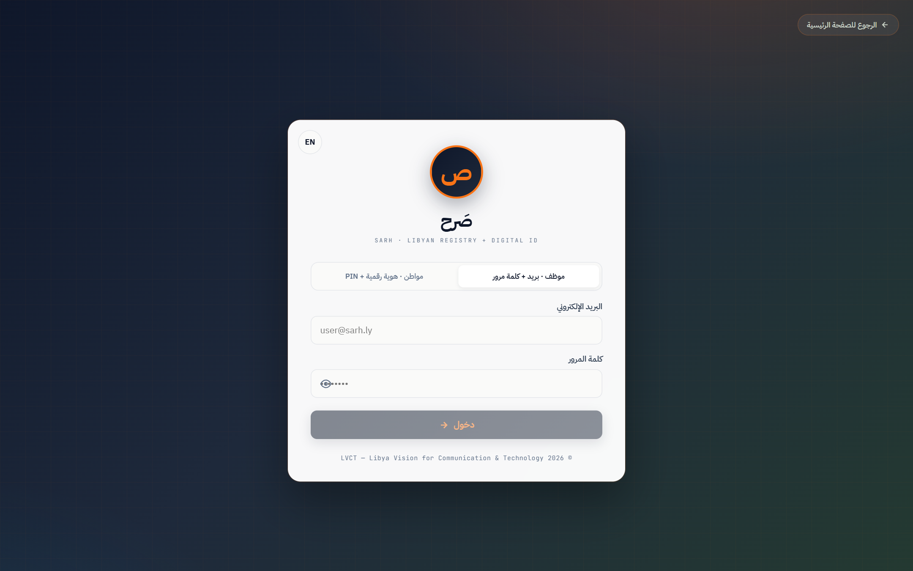
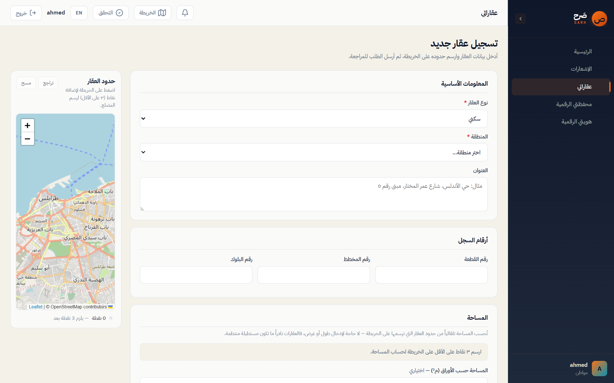
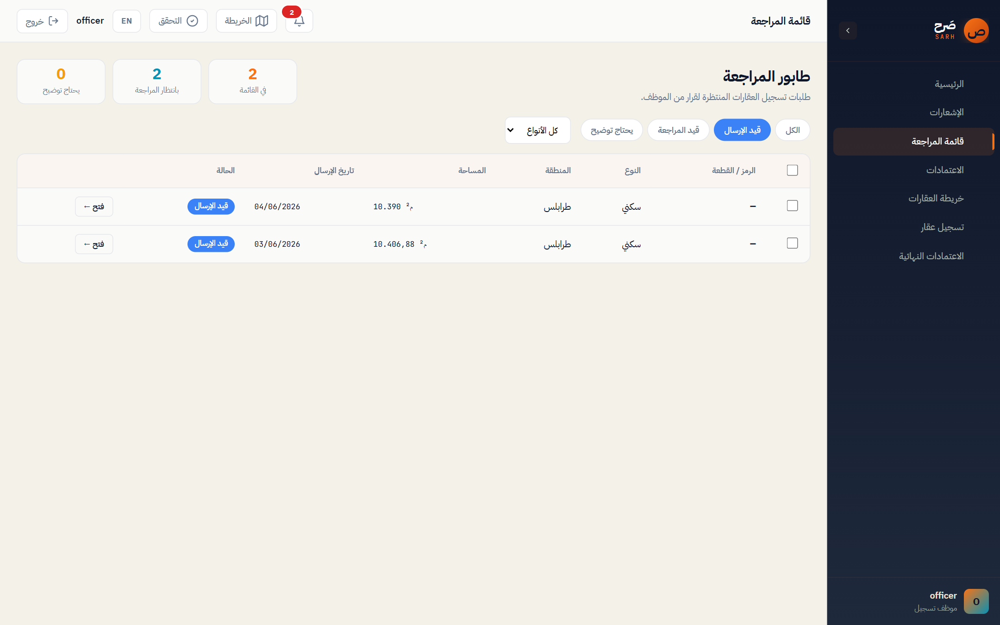
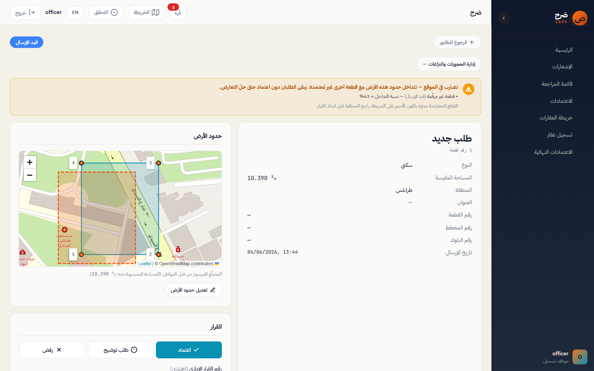
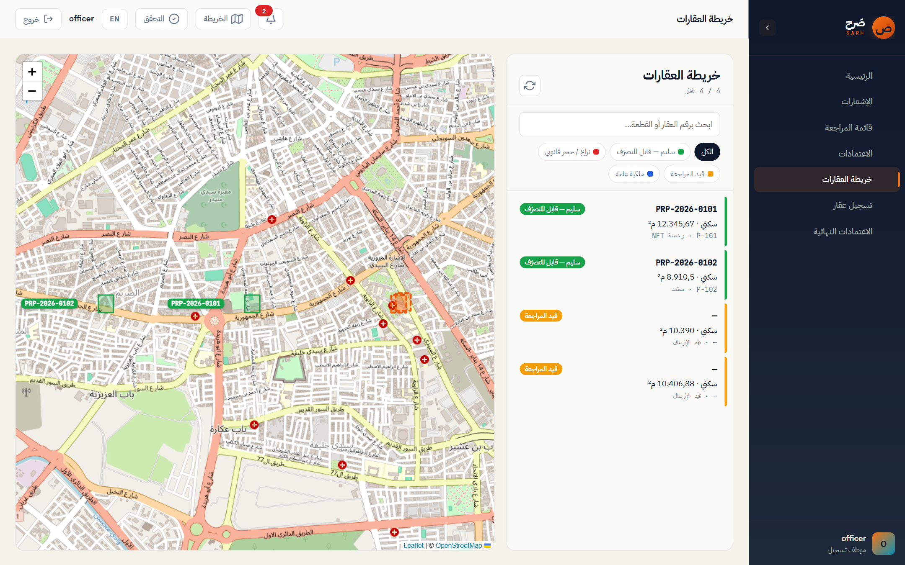
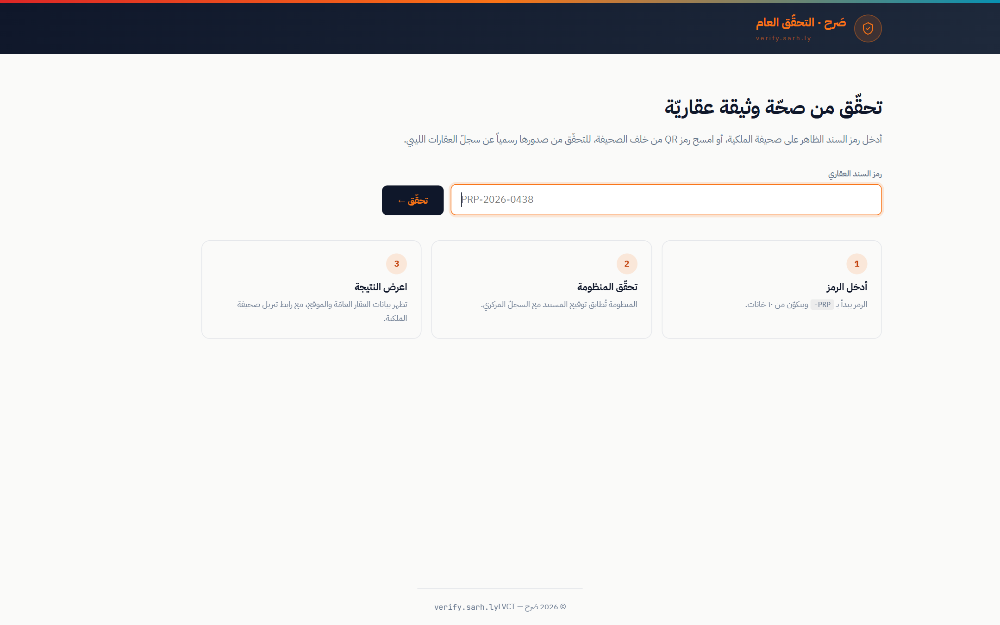
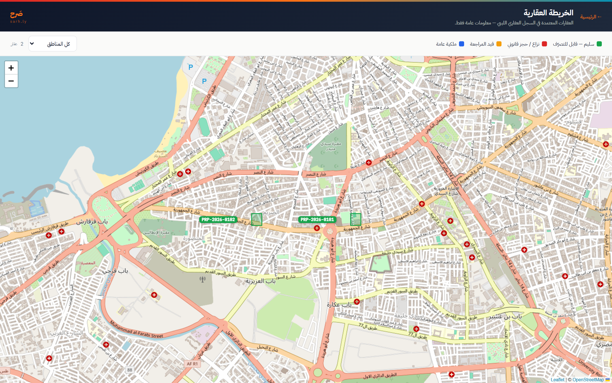

<div dir="rtl">

# منصة صَرح (Sarh) — تقرير مرحلتَي التنفيذ والاختبار

> **المشروع:** منصّة صَرح — السجل العقاري الليبي + إصدار الهوية الرقمية
> **الجهة المالكة:** الرؤية الليبية للاتصالات والتقنية (LVCT)
> **طبيعة النظام:** نظام ويب + خدمة خلفية + تطبيق محمول، يعمل بالعربية أولاً (RTL).

---

# 4. مرحلة التنفيذ (Implementation Phase)

## 1.4 بيئة العمل وأدوات التطوير (Development Environment & Tools)

في هذا القسم تُسرد الخيارات التقنية التي بُني عليها النظام فعلياً، مع تبرير كل اختيار.

### أ) لغات البرمجة (Programming Languages)

| اللغة | الإصدار | موضع الاستخدام | سبب الاختيار |
|------|---------|----------------|---------------|
| **C#** | 12 (على .NET 8) | الخدمة الخلفية (Backend API) | لغة مُدارة قوية الأنواع (strongly-typed)، أداء عالٍ، ودعم أصيل لـ SQL Server والتشفير (`System.Security.Cryptography`) المطلوب لبطاقات NFC وتوقيع الصكوك. |
| **TypeScript** | 5.4.5 | تطبيق الويب (Angular) | إضافة الأنواع الثابتة إلى JavaScript تقلّل الأخطاء في واجهة كبيرة متعددة الأدوار، وتشارك نماذج البيانات مع الخلفية عبر حزمة `shared-types`. |
| **Dart** | 3.4 | تطبيق الهاتف (Flutter) | لغة Flutter الرسمية؛ ترجمة أصلية (AOT) لأداء قريب من الأصلي على أندرويد/iOS. |
| **T-SQL** | SQL Server 2019/2022 | قاعدة البيانات (مخططات، إجراءات، مُحفّزات) | تنفيذ منطق حسّاس مكانياً (geography) ومُحفّزات سجل التدقيق غير القابل للتعديل مباشرةً داخل المحرك. |
| **SCSS / HTML5** | — | تنسيق واجهات الويب | رموز تصميم (design tokens) للهوية البصرية بدل مكتبة جاهزة، مع دعم RTL كامل. |

### ب) أُطر العمل والمكتبات (Frameworks & Libraries)

**الخلفية (Backend):**
- **ASP.NET Core 8** — إطار خدمة الويب وREST API. يوفّر التوجيه، حقن الاعتماديات (DI)، و«الوسطاء» (middleware) للمصادقة وتحديد المعدّل (rate limiting).
- **Entity Framework Core 8** + `Microsoft.Data.SqlClient` — الوصول إلى البيانات. نستخدم EF للاستعلامات العادية، وننزل إلى `SqlCommand` المباشر للعمليات المكانية (geography) التي لا يجرّدها EF.
- **BCrypt.Net-Next** — تجزئة كلمات المرور (مقاومة لهجمات القوة الغاشمة عبر معامل التكلفة).
- **System.IdentityModel.Tokens.Jwt** — توقيع/تحقق رموز JWT بخوارزمية HS256.

**الويب (Web):**
- **Angular 21** — تطبيق صفحة واحدة (SPA) موحّد يضم جميع الأدوار (مواطن، موظف سجل، مُصدِّر هوية، مدير، مدقّق، تحقق عام) خلف توجيه قائم على الصلاحيات.
- **Angular Signals** — إدارة الحالة التفاعلية الحديثة (`signal`, `computed`) بدل RxJS الثقيل في معظم المكوّنات.
- **Leaflet** — عرض الخرائط ورسم مضلّعات حدود الأراضي (بديل خفيف ومفتوح المصدر).

**الهاتف (Mobile):**
- **Flutter 3.22+** — إطار واجهة المستخدم متعدّد المنصّات.
- **Riverpod 2.x** — إدارة الحالة (نمط شبيه بـ MVVM).
- **go_router** — التوجيه المعتمد على المسارات.
- **flutter_nfc_kit** — قراءة بطاقات NTAG 424 DNA.
- **mapbox_maps_flutter** — الخرائط ورسم الحدود على الهاتف.

**الهوية ذاتية السيادة (SSI):**
- **Hyperledger Aries Cloud Agent Python (ACA-Py) v0.12+** — إصدار «الاعتمادات القابلة للتحقق» (Verifiable Credentials) بطريقة `did:sov`.

### ج) قاعدة البيانات (Database) وإعدادها

- **المحرّك:** SQL Server 2019/2022 محلياً.
- **النوع المكاني `geography`** (SRID 4326) لتخزين مضلّعات الأراضي وحساب المساحات والتداخل (`STArea`, `STIntersects`, `STIntersection`, `EnvelopeCenter`).
- **فهرس النص الكامل (Full-Text, عربي)** للبحث في أسماء المواطنين والعقارات.
- **سجل تدقيق (audit_log) إلحاقي فقط** عبر مُحفّزات `INSTEAD OF UPDATE/DELETE` تمنع أي تعديل أو حذف.
- **التهيئة الأساسية = ترحيلات EF Core (EF Migrations):** كل ملف T-SQL مرقّم (`infra/mssql/migrations/000…044.sql`) مُضمَّن داخل التجميعة كـ `EmbeddedResource`، ويطبّقه `EfDatabaseBootstrapper` تلقائياً عند الإقلاع، ويسجّله في `__EFMigrationsHistory`. ميزة هذا الأسلوب أنه يعمل على أي جهاز فيه .NET 8 SDK وخادم SQL Server، دون الحاجة إلى `sqlcmd` أو تشغيل ملفات يدوياً.

> التشغيل: `pnpm db:migrate:ef` (تهيئة ثم خروج) أو `pnpm db:reset:ef` (إعادة بناء كاملة).

### د) بيئات التطوير المتكاملة (IDEs)

| الأداة | الاستخدام |
|--------|-----------|
| **Visual Studio 2022 / VS Code** | تطوير الخلفية C# / .NET. |
| **VS Code** | تطوير الويب (Angular/TypeScript) وملفات SCSS وSQL. |
| **Android Studio** | تطوير ومحاكاة تطبيق Flutter. |
| **SQL Server Management Studio (SSMS)** | فحص قاعدة البيانات والاستعلامات المكانية. |

### هـ) أدوات إدارة النسخ (Version Control)

- **Git** نظام التحكم بالإصدارات، و**GitHub** للاستضافة والمراجعة.
- **سير العمل بالفروع (Branching):** فرع رئيسي `main` مستقر، وفروع ميزات وصفية مثل `feature/idissuer-nav-and-card-list-actions`.
- **طلبات الدمج (Pull Requests):** كل ميزة تُدمج عبر PR تتم مراجعته (انظر سجل المشروع: PR #12–#16).
- **خطّافات Git (`core.hooksPath = .githooks`)** تُفعَّل تلقائياً عبر سكربت `prepare` للتحقق قبل الالتزام.

---

## 2.4 البنية البرمجية وهندسة النظام (System Architecture & Coding Structure)

### أ) هيكل المجلدات (Folder Structure)

```text
sarh/
├── apps/
│   ├── api-dotnet/              # الخدمة الخلفية ASP.NET Core 8
│   │   ├── Program.cs           # نقطة الإقلاع + تسجيل الخدمات والوسطاء
│   │   ├── Auth/                # مصادقة JWT + bcrypt + الصلاحيات
│   │   ├── Citizens/            # وحدة المواطنين
│   │   ├── Properties/          # وحدة العقارات (الخدمة + DTOs + GeoJSON)
│   │   │   ├── PropertiesService.cs
│   │   │   ├── PropertyDtos.cs
│   │   │   └── GeoJsonPolygon.cs
│   │   ├── DigitalIdCards/      # إصدار بطاقات الهوية الرقمية
│   │   ├── Nfc/                 # تشفير NTAG 424 DNA (SUN + AES-CMAC)
│   │   ├── Map/                 # تغذية الخريطة (مضلّعات للموظف/العامة)
│   │   ├── Disputes/            # النزاعات/الحجوزات على العقارات
│   │   ├── Verify/             # التحقق العام + صكّ PDF
│   │   ├── Ssi/                 # تكامل ACA-Py للاعتمادات القابلة للتحقق
│   │   ├── Workflow/            # سير اعتماد الطلبات + توقيع الصكوك
│   │   ├── Audit/               # اعتراض الكتابة وتسجيل التدقيق
│   │   ├── Controllers/         # المتحكمات (REST endpoints)
│   │   ├── Data/                # سياق EF + المُهيّئ (Bootstrapper)
│   │   └── Migrations/          # سجل ترحيلات EF (يُطابق ملفات T-SQL)
│   │
│   ├── web/                     # تطبيق Angular 21 موحّد (المنفذ 4200)
│   │   └── src/app/
│   │       ├── core/            # خدمات مشتركة (auth، properties، map…)
│   │       ├── shared/          # مكوّنات مشتركة (parcel-map…)
│   │       └── features/        # الميزات حسب الدور
│   │           ├── auth/        # تسجيل الدخول
│   │           ├── citizen/     # المواطن (تقديم عقار…)
│   │           ├── officer/     # موظف السجل (طابور/مراجعة/خريطة/حدود)
│   │           ├── manager/     # الاعتماد النهائي
│   │           ├── id-issuer/   # محطة إصدار الهوية
│   │           ├── admin/       # لوحة الإدارة والتقارير
│   │           ├── map/         # الخريطة العامة
│   │           └── verify/      # التحقق العام
│   │
│   └── mobile/                  # تطبيق Flutter (المواطن)
│
├── packages/
│   ├── shared-types/            # واجهات TypeScript مشتركة
│   ├── ui-kit/                  # مكوّنات Angular (RTL)
│   └── flutter-shared/          # نماذج/ودجات Dart مشتركة
│
├── infra/
│   └── mssql/migrations/        # ترحيلات T-SQL المرقّمة 000…044
│
├── docs/                        # المخططات، الويرفريم، هذا التقرير
└── scripts/db/                  # سكربتات ترحيل قاعدة البيانات
```

### ب) نمط التصميم البرمجي (Design Patterns)

النظام **بنية موجَّهة بالوحدات (Modular Monolith)** على مستوى الخدمة الخلفية، مع أنماط مختلفة لكل طبقة:

1. **الخلفية — طبقات (Layered) + Controller/Service:**
   - **المتحكم (Controller)** يستقبل الطلب ويتحقق من النموذج فقط، ثم يفوّض للخدمة.
   - **الخدمة (Service)** تحوي منطق الأعمال (مثل `PropertiesService.SubmitAsync`).
   - **طبقة البيانات** عبر EF Core + إجراءات SQL المخزّنة للعمليات المكانية.
   - **الفصل بين المسؤوليات (Separation of Concerns)** واضح: لا منطق أعمال داخل المتحكمات، ولا SQL داخلها.

   مثال (متحكم رفيع يفوّض للخدمة):
   ```csharp
   [HttpPost]
   [EnableRateLimiting(RateLimitPolicies.Write)]
   [Audit(Action = AuditActions.Create, Entity = "properties", EntityIdFrom = "property.id")]
   public Task<SubmitResult> Submit([FromBody] CreatePropertyDto dto, CancellationToken ct)
       => svc.SubmitAsync(dto, User.RequireUser(), ct);
   ```

2. **الويب (Angular) — مكوّنات مستقلّة (Standalone Components) + خدمات (Services):**
   - كل شاشة مكوّن مستقل (`standalone: true`) مع `ChangeDetectionStrategy.OnPush` للأداء.
   - الحالة عبر **Signals** (`signal`/`computed`)، والوصول للـ API عبر خدمات في `core/`.
   - هذا قريب من نمط **MVVM** (المكوّن = View + ViewModel، والخدمة = Model/Gateway).

3. **الهاتف (Flutter) — MVVM عبر Riverpod:**
   - الودجات = العرض، و«المزوّدات» (Providers) تحمل الحالة والمنطق، والمستودعات (Repositories) تتحدث مع الـ API.

4. **الصلاحيات — خريطة JSON بدل فحص الأدوار نصياً:**
   - لا يُفحص الدور بنصوص حرّة في الكود؛ يمرّ كل تحقّق عبر خريطة صلاحيات على `officers.permissions`، ويُفرض على الواجهة عبر دالة `canRoleAccess` الموحّدة.

5. **سجل التدقيق — نمط الاعتراض (Interceptor):**
   - كل عملية كتابة تمرّ عبر سِمة `[Audit]` تُسجّل العملية تلقائياً، والمحرّك يمنع تعديل/حذف السجل عبر مُحفّزات `INSTEAD OF`.

---

## 3.4 لقطات الشاشة وواجهات المستخدم (User Interface Screenshots)

> ملاحظة: تُدرج هنا لقطات شاشة حقيقية عالية الجودة من النظام أثناء التشغيل. يوضّح الجدول لكل واجهة: المسار في النظام، الدور، المدخلات، والمخرجات. (ضع اللقطة في الموضع المحدّد.)

### واجهة تسجيل الدخول (Login)
**المسار:** `/login` · **الملف:** `apps/web/src/app/features/auth/login.page.ts`

<figure>

<figcaption>الشكل 1: صفحة تسجيل الدخول الموحّدة — موظف (بريد + كلمة مرور) أو مواطن (هوية رقمية + PIN).</figcaption>
</figure>

- **الوظيفة:** دخول موحّد لكل الأدوار، بوضعين: موظف (بريد + كلمة مرور) ومواطن (رقم الهوية الرقمية + PIN من 6 أرقام).
- **المدخلات:** البريد/كلمة المرور، أو رقم الهوية الرقمية (مثل `LY-11-2026-000101-0`) + PIN.
- **المخرجات:** رمز JWT يُخزَّن، وإعادة توجيه ذكية للصفحة المناسبة للدور.

### تقديم عقار جديد ورسم الحدود (Citizen — New Property)
**المسار:** `/app/my/...` · **الملف:** `features/citizen/pages/new-property.page.ts`

<figure>

<figcaption>الشكل 2: رسم حدود الأرض على الخريطة مع إظهار الأراضي المسجّلة كخلفية رمادية لتفادي الرسم فوقها.</figcaption>
</figure>

- **الوظيفة:** يرسم المواطن مضلّع حدود أرضه على خريطة Leaflet بالنقر على الزوايا، ويرفق صورة موقع وشهادة كروكي (koreky).
- **المدخلات:** نقاط المضلّع (≥3)، نوع العقار، المنطقة، المساحة، المستندات.
- **المخرجات:** طلب تسجيل بحالة `pending`، مع مساحة محسوبة من المضلّع يُعاد حسابها في الخادم.

### طابور المراجعة (Officer Queue)
**المسار:** `/app/queue` · **الملف:** `features/officer/pages/queue.page.ts`

<figure>

<figcaption>الشكل 3: طابور طلبات المراجعة الواردة لموظف المنطقة.</figcaption>
</figure>

- **الوظيفة:** يعرض الطلبات الواردة لمنطقة الموظف للمراجعة.
- **المخرجات:** قائمة طلبات قابلة للفتح للمراجعة التفصيلية.

### مراجعة الطلب (Officer Review)
**المسار:** `/app/review/:id` · **الملف:** `features/officer/pages/review.page.ts`

<figure>

<figcaption>الشكل 4: شاشة مراجعة العقار مع تنبيه «تضارب في الموقع» وإبراز القطعة المتداخلة على الخريطة (نسبة تداخل ≈ 63%) — تبقى القطعتان دون اعتماد حتى حلّ التعارض.</figcaption>
</figure>

- **الوظيفة:** يعرض حدود الأرض على الخريطة، المستندات المرفقة، تحذيرات التداخل/النزاع، وقرار الموظف (اعتماد/رفض/طلب توضيح).
- **المدخلات:** قرار + ملاحظة + رقم قرار اعتماد (عند الاعتماد).
- **المخرجات:** تغيير حالة العقار وإشعار المواطن.

### الخريطة المساحية للموظف (Officer Map)
**المسار:** `/app/map` (officer) · **الملف:** `features/officer/pages/map.page.ts`

<figure>

<figcaption>الشكل 5: الخريطة المساحية لكل قطع المنطقة، بألوان حسب الحالة مع تمييز التضاربات.</figcaption>
</figure>

- **الوظيفة:** عرض كل قطع المنطقة بألوان حسب الحالة (واضح/متنازَع/قيد العمل)، لكشف التداخل والنزاعات بصرياً.

### الاعتماد النهائي (Manager Approve)
**الملف:** `features/manager/pages/manager-approve.page.ts`

- **الوظيفة:** الاعتماد النهائي قبل سكّ سجل الملكية (NFT) وإصدار الصكّ الموقّع.

### محطة إصدار الهوية الرقمية (ID Issuer)
**الملف:** `features/id-issuer/...`

`[ أدرج لقطة شاشة: محطة الإصدار + بطاقة NFC ]`

- **الوظيفة:** إصدار بطاقة هوية رقمية على شريحة NTAG 424 DNA مع PIN وصلاحية.

### التحقق العام (Public Verify)
**الملف:** `features/verify/...` · **الرابط العام:** `verify.sarh.ly/{deed_id}`

<figure>

<figcaption>الشكل 6: بوابة التحقق العام من صحة الصكوك.</figcaption>
</figure>

- **الوظيفة:** يتحقق أي شخص من صحة صكّ عبر رمز QR؛ النظام يتحقق من توقيع PAdES ويعرض الصكّ.

### الخريطة العقارية العامة (Public Map)
**المسار:** `/map` · **الملف:** `features/map/public-map.page.ts`

<figure>

<figcaption>الشكل 7: الخريطة العقارية العامة — تعرض العقارات الصادرة صكوكها فقط، دون أي بيانات شخصية.</figcaption>
</figure>

---

## 4.4 الخوارزميات والبرمجيات الذكية (Core Algorithms & Code Snippets)

نركّز هنا على «عصب» النظام: الأجزاء البرمجية الحسّاسة والذكية.

### الخوارزمية (1): كشف تداخل الأراضي مكانياً (Spatial Overlap Detection)

هذا قلب منع الاحتيال (بيع الأرض الواحدة لأكثر من شخص). نستخدم نوع `geography` في SQL Server: `STIntersects` يكشف وجود تقاطع، و`STIntersection().STArea()` يحسب مساحة التداخل، وتُحوَّل إلى نسبة مئوية من مساحة المضلّع الجديد.

```csharp
// apps/api-dotnet/Properties/PropertiesService.cs
public async Task<IReadOnlyList<PropertyOverlap>> OverlapCheckAsync(OverlapCheckDto dto, CancellationToken ct)
{
    var (wkt, _) = GeoJsonPolygon.ValidateAndConvert(dto.Polygon);
    var rows = new List<PropertyOverlap>();
    // ...
    cmd.CommandText = @"
        DECLARE @poly geography = geography::STGeomFromText(@wkt, 4326);
        SELECT p.id, p.property_code, p.parcel_number,
               ROUND(CAST(p.boundary_polygon.STIntersection(@poly).STArea() AS DECIMAL(18,6))
                     / NULLIF(CAST(@poly.STArea() AS DECIMAL(18,6)), 0) * 100.0, 2) AS overlap_pct
        FROM properties p
        WHERE p.boundary_polygon IS NOT NULL
          AND p.status = N'approved'
          AND p.boundary_polygon.STIntersects(@poly) = 1;";
    // ... قراءة النتائج إلى PropertyOverlap (المعرّف، الرمز، رقم القطعة، نسبة التداخل)
}
```

### الخوارزمية (2): تفرّد مركز القطعة (Centroid Uniqueness — منع الإحداثي المكرّر)

لا يجوز لعقارَين معتمدَين أن يتشاركا المركز نفسه. نحسب المركز بـ `EnvelopeCenter()` ونقارن بـ `STEquals`، مع فهرس فريد مُرشَّح يضمن ذلك على مستوى المحرّك.

```sql
-- infra/mssql/migrations/006_properties.sql
CREATE UNIQUE INDEX ux_properties_unique_approved_point
    ON properties(location_point_wkt)
    WHERE status = N'approved' AND location_point_wkt IS NOT NULL;
```

```csharp
// عند التقديم: رفض نظيف (409) إن وُجد عقار معتمد بنفس المركز
if (validation.HasApprovedCentroidMatch)
{
    throw SarhException.Conflict(
        $"يوجد عقار معتمد مسبقاً بنفس الإحداثيات (الرمز {validation.MatchedPropertyCode}).",
        $"An approved property with the same centroid exists (code {validation.MatchedPropertyCode}).");
}
```

### الخوارزمية (3): حساب المساحة من المضلّع لا من الطول×العرض

القطع نادراً ما تكون مستطيلة، لذا تُشتق المساحة من المضلّع المرسوم. العميل يقدّر المساحة بصيغة «الفائض الكروي» (spherical excess) كتلميح فوري، والخادم يعيد الحساب رسمياً عبر `geography.STArea()` ويتحقق ضمن ±5%.

```typescript
// apps/web/.../new-property.page.ts — تقدير المساحة على العميل
private geographicArea(latlngs: L.LatLng[]): number {
  const R = 6378137; // نصف قطر الأرض (م)
  let area = 0;
  const n = latlngs.length;
  for (let i = 0; i < n; i++) {
    const p1 = latlngs[i];
    const p2 = latlngs[(i + 1) % n];
    area +=
      ((p2.lng - p1.lng) * Math.PI) / 180 *
      (2 + Math.sin((p1.lat * Math.PI) / 180) + Math.sin((p2.lat * Math.PI) / 180));
  }
  return Math.abs((area * R * R) / 2);
}
```

### الخوارزمية (4): رمز NFC المتدحرج المقاوم للاستنساخ (NTAG 424 DNA — SUN)

المعرّف الثابت (UID) للبطاقة وحده لا يكفي. كل لمسة تُنتج رسالة SUN فيها عدّاد متدحرج (counter) يُتحقَّق منه في الخادم بمفتاح جلسة مشتقّ عبر AES-CMAC؛ أي إعادة تشغيل لرسالة قديمة تُرفض لأن العدّاد لا يتقدّم.

```csharp
// apps/api-dotnet/Nfc/SunMessage.cs
public static DecodedSun Verify(SunKeys keys, string piccDataHex, string cmacHex)
{
    var picc = ParseHex(piccDataHex, 16, "malformed_picc");
    var providedCmac = ParseHex(cmacHex, 8, "malformed_cmac");

    // 1) فكّ تشفير بيانات PICC بمفتاح القراءة (AES-128-CBC، IV=0)
    // ... aes.Key = keys.MetaReadKey ...
    if (plaintext[0] != PiccDataTagUidAndCounter)
        throw new SunDecodeException("bad_picc_tag");

    var uid = new byte[7];
    Buffer.BlockCopy(plaintext, 1, uid, 0, 7);
    int counter = plaintext[8] | (plaintext[9] << 8) | (plaintext[10] << 16);

    // 2) اشتقاق مفتاح CMAC للجلسة من (UID, counter)
    var sessionKey = DeriveSessionCmacKey(keys.SdmFileReadKey, uid, counter);

    // 3) حساب CMAC ومقارنته بزمن ثابت (يمنع هجوم التوقيت)
    var expectedShort = TakeShortCmac(AesCmac.Compute(sessionKey, Array.Empty<byte>()));
    if (!CryptographicOperations.FixedTimeEquals(expectedShort, providedCmac))
        throw new SunDecodeException("cmac_mismatch");

    return new DecodedSun { Uid = uid, Counter = counter };
}
```

### الخوارزمية (5): توقيع الصكّ رقمياً (PAdES) والتحقق منه

كل صكّ PDF يُوقَّع رقمياً (PAdES)؛ أي عبث ولو ببِت واحد يُبطل التوقيع، ويحمل رمز QR يشير إلى `verify.sarh.ly/{deed_id}`.

```csharp
// مقتطف من اختبار التوقيع (يبرهن سلوك الخوارزمية)
var signature = DeedSignature.Sign(cert, content);
Assert.True(DeedSignature.Verify(content, signature).Valid);

var tampered = (byte[])content.Clone();
tampered[^1] ^= 0xFF;                       // قلب بِت في آخر بايت
Assert.False(DeedSignature.Verify(tampered, signature).Valid); // يُكشف العبث
```

### الخوارزمية (6): مصادقة JWT (HS256) + bcrypt

رمز الدخول موقّع بـ HMAC-SHA256، ولا يحوي أي بيانات شخصية حسّاسة — فقط `sub`, `citizen_id`/`officer_id`, `role`, `exp`. كلمات المرور مُجزّأة بـ bcrypt.

```csharp
// apps/api-dotnet/Auth/JwtTokenService.cs
var creds = new SigningCredentials(SigningKey, SecurityAlgorithms.HmacSha256);
var jwt = new JwtSecurityToken(
    claims: claims,
    notBefore: now.UtcDateTime,
    expires: now.AddSeconds(AccessTtlSeconds).UtcDateTime,
    signingCredentials: creds);
return (new JwtSecurityTokenHandler().WriteToken(jwt), AccessTtlSeconds);
```

### الخوارزمية (7): سجل التدقيق الإلحاقي (Append-Only Audit)

سجل التدقيق لا يقبل تعديلاً أو حذفاً نهائياً، عبر مُحفّزات `INSTEAD OF` في المحرّك — ضمان قانوني لعدم التلاعب بالسجل.

```sql
-- infra/mssql/migrations/011_audit.sql
-- يمنع أي UPDATE/DELETE على audit_log حتى من حساب بصلاحيات عالية
CREATE OR ALTER TRIGGER tr_audit_log_no_update ON audit_log
INSTEAD OF UPDATE AS
BEGIN
    THROW 51001, N'audit_log is append-only — UPDATE blocked', 1;
END
GO
CREATE OR ALTER TRIGGER tr_audit_log_no_delete ON audit_log
INSTEAD OF DELETE AS
BEGIN
    THROW 51002, N'audit_log is append-only — DELETE blocked', 1;
END
```

---

## 5.4 التحديات والحلول (Challenges & Solutions)

### 1) تحديات تقنية وبرمجية (Technical Challenges)

| المشكلة | الحل الفعلي |
|---------|--------------|
| **ترميز UTF-16 يفسد ملفات المشروع:** PowerShell يكتب الملفات افتراضياً بـ UTF-16، ممّا أفسد `package.json` وعطّل بناء Angular على النسخ الجديدة. | إعادة ترميز الملفات إلى **UTF-8 بدون BOM**، واعتماد قاعدة بعدم توليد ملفات نصية عبر PowerShell الافتراضي. |
| **توقيت إقلاع خرائط Leaflet:** الخرائط داخل `@if` في Angular تُهيَّأ قبل قياس حاويتها فتُقرّب على «لا شيء» (بدا وكأن المضلّع لم يُحفظ). | تأجيل تهيئة الخريطة (`setTimeout(0)`) بعد ظهور الحاوية، ثم استدعاء `invalidateSize()` و`fitBounds()`. |
| **تعارض إصدارات/منافذ التشغيل:** حاوية Grafana لمشروع آخر تحجز المنفذ 3001 المستخدم للـ API. | تثبيت منفذ مستقل للـ API وإيقاف الحاوية المتعارضة عند التطوير المحلي. |
| **عدم قدرة `dotnet ef database update` على تطبيق 45 ملف T-SQL خام:** | بناء **مُهيّئ مخصّص** (`EfDatabaseBootstrapper`) يطبّق الدفعات مباشرة (تقسيم على `GO`) ويختم `__EFMigrationsHistory`، مع «خط أساس» (baseline) لقواعد قائمة دون إعادة بناء مدمّرة. |

### 2) تحديات متعلّقة بالبيانات (Data Challenges)

| المشكلة | الحل الفعلي |
|---------|--------------|
| **`NULL UNIQUE` في SQL Server يعتبر قيمتَي NULL متطابقتَين** فيرفض صفَّين فارغَين. | استخدام **فهارس فريدة مُرشَّحة** (`WHERE col IS NOT NULL`) بدل قيد `UNIQUE` العادي. |
| **شُحّ بيانات الاختبار الواقعية** (مواطنون/عقارات/مناطق). | كتابة ملفات بذور (seed) موسّعة: `024`, `026`, `029`, `034`, `044` تولّد بيانات تجريبية واقعية بالعربية، مع إحداثيات حقيقية للمناطق (الشعبيات). |
| **البحث العربي في الأسماء** | تفعيل فهرس **النص الكامل العربي** (`035_properties_fulltext.sql`) لدعم البحث الذكي. |

### 3) تحديات الربط والتكامل (Integration Challenges)

| المشكلة | الحل الفعلي |
|---------|--------------|
| **أخطاء CORS** عند ربط واجهة Angular (المنفذ 4200) بالخدمة الخلفية. | ضبط سياسة CORS على الخادم لقصر الوصول على الواجهات المعروفة فقط، وتمرير الترويسات اللازمة (Authorization). |
| **عنوان API على Flutter:** `10.0.2.2` يعمل على المحاكي فقط؛ الجهاز الفعلي يحتاج `adb reverse`. | حلّال عنوان عند الإقلاع يجرّب تلقائياً `localhost`/`127.0.0.1`/`10.0.2.2` ويختار العامل. |

### APIs Integration — كيفية الربط وشكل الطلب والاستجابة

كل الواجهات REST تحت `/api/v1/`، والاستجابات بصيغة JSON، والأخطاء بمغلّف موحّد:
```json
{ "error": { "code": "ERR_X", "message_ar": "...", "message_en": "..." } }
```

**مثال 1 — تسجيل دخول الموظف:**
```http
POST /api/v1/auth/login
Content-Type: application/json

{ "email": "officer@sarh.ly", "password": "••••••••" }
```
```json
// 200 OK
{ "access_token": "eyJhbGci...", "expires_in": 3600,
  "user": { "role": "registry_officer", "officer_id": "…", "region_id": 11 } }
```

**مثال 2 — فحص التداخل قبل التقديم (Overlap Check):**
```http
POST /api/v1/properties/overlap-check
Authorization: Bearer <jwt>

{ "polygon": { "type": "Polygon", "coordinates": [[[13.18,32.88],[13.19,32.88],[13.19,32.89],[13.18,32.88]]] } }
```
```json
// 200 OK — قائمة العقارات المتداخلة ونسبة التداخل
{ "overlaps": [ { "propertyId": "…", "propertyCode": "LY-11-2026-000042",
                  "parcelNumber": "P-2026-001", "overlapPct": 15.75 } ] }
```

**مثال 3 — تقديم عقار:**
```http
POST /api/v1/properties
Authorization: Bearer <jwt>

{ "propertyType": "residential", "regionId": 11, "areaSqm": 420.00,
  "boundaryPolygon": { "type": "Polygon", "coordinates": [[...]] },
  "documents": [ { "kind": "site_photo", "ref": "sarh/…jpg" },
                 { "kind": "koreky_certificate", "ref": "sarh/…pdf" } ] }
```
```json
// 200 OK
{ "property": { "id": "…", "status": "pending", "areaSqm": 420.00 },
  "registrationRequest": { "requestNo": "REQ-2026-000123", "currentStatus": "pending" },
  "validation": { "computedAreaSqm": 418.6, "areaDiffPct": 0.33 } }
```

> طريقة العمل: تُرفع الملفات أولاً عبر `POST /api/v1/uploads/property-document` (يعيد مرجعاً `"<bucket>/<path>"`)، ثم تُرسل مراجعها ضمن مصفوفة `documents[]` في طلب التقديم. ويُرفض الطلب إن نقصت صورة موقع أو شهادة كروكي.

---

# 5. مرحلة الاختبار (Testing)

## 1.5 استراتيجية وخطة الاختبار (Testing Strategy & Environment)

### بيئة الاختبار (Testing Environment)

| العنصر | المواصفات |
|--------|-----------|
| نظام التشغيل | Windows 11 |
| المتصفّح | Google Chrome (أحدث إصدار) — للويب |
| الهاتف | محاكي/جهاز أندرويد 13 — لتطبيق Flutter |
| الخادم المحلي | SQL Server 2019/2022، ذاكرة 8GB |
| منصّة الخلفية | .NET 8 SDK |
| منصّة الويب | Node.js 20+ / pnpm 9 / Angular 21 |

### الأدوات المستخدمة (Testing Tools)

| الأداة | الغرض |
|--------|-------|
| **xUnit** (`apps/api-dotnet.Tests`) | اختبارات الوحدة للخلفية (.NET). |
| **Postman** | اختبار واجهات REST يدوياً والتأكد من رموز الحالة. |
| **Flutter test** (`apps/mobile/test`) | اختبارات ودجات Flutter. |
| **Karma/Jasmine** (Angular) | اختبارات مكوّنات الويب. |
| **فحص يدوي (RTL)** | التأكد من سلامة الواجهة العربية بمحتوى عربي حقيقي. |

---

## 2.5 مستويات وأنواع الاختبارات (Testing Levels & Types)

### 1.2.5 اختبار الوحدات (Unit Testing)

فحص الدوال والأجزاء الصغيرة المعزولة. يحوي المشروع مشروع اختبارات فعلياً: `apps/api-dotnet.Tests` بعدّة ملفات (`DeedSignatureTests`, `IdentityHashTests`, `RateLimitPoliciesTests`, `SmsTests`, `SsiCredentialBuilderTests`).

مثال — اختبار توقيع الصكّ يثبت أن العبث يُكشف (علامة النجاح الخضراء `Passed`):
```csharp
[Fact]
public void Verify_FailsWhenContentTampered()
{
    using var cert = NewCert();
    var content = DeedBytes();
    var signature = DeedSignature.Sign(cert, content);

    var tampered = (byte[])content.Clone();
    tampered[^1] ^= 0xFF; // قلب بِت
    Assert.False(DeedSignature.Verify(tampered, signature).Valid);
}
```
التشغيل: `dotnet test apps/api-dotnet.Tests`  → النتيجة المتوقّعة: كل الاختبارات **Passed**.

`[ أدرج لقطة شاشة: مخرجات dotnet test وكلها خضراء ]`

### 2.2.5 اختبار التكامل (Integration Testing)

التأكد من تدفّق البيانات بين الطبقات: من واجهة المستخدم → API → قاعدة البيانات والعودة. نركّز على واجهات REST والتأكد من رموز الحالة الصحيحة.

| الواجهة | الطلب | الاستجابة المتوقّعة |
|---------|-------|---------------------|
| `POST /auth/login` | بيانات صحيحة | `200 OK` + رمز JWT |
| `POST /auth/login` | كلمة مرور خاطئة | `401 Unauthorized` |
| `POST /properties/overlap-check` | مضلّع متداخل | `200 OK` + قائمة `overlaps` |
| `POST /properties` | بدون صورة/كروكي | `422` (مستندات ناقصة) |
| `GET /verify/{code}/deed.pdf` | رمز صكّ صحيح | `200 OK` + ملف PDF موقّع |

`[ أدرج لقطة شاشة: Postman يُظهر 200 OK ]`

### 3.2.5 اختبار النظام الكلّي (System / End-to-End Testing)

تجربة النظام ككتلة واحدة من منظور المستخدم النهائي. يوثَّق عبر **جدول حالات الاختبار** (أهم قسم):

| # | حالة الاختبار | الخطوات | المُدخل | الناتج المتوقّع | النتيجة |
|---|----------------|---------|---------|-----------------|---------|
| T-01 | دخول موظف | إدخال بريد + كلمة مرور | بيانات صحيحة | الانتقال للوحة الموظف | ✅ نجح |
| T-02 | دخول مواطن بـ PIN | إدخال الهوية + PIN | PIN صحيح | الانتقال لصفحة المواطن | ✅ نجح |
| T-03 | تقديم عقار برسم المضلّع | رسم ≥3 نقاط + إرفاق مستندات | مضلّع صالح | إنشاء طلب `pending` | ✅ نجح |
| T-04 | رفض تقديم بلا مستندات | رسم دون صورة/كروكي | مستندات ناقصة | رسالة خطأ عربية + رفض | ✅ نجح |
| T-05 | منع الإحداثي المكرّر | تقديم على مركز عقار معتمد | مركز مطابق | رفض `409` برسالة واضحة | ✅ نجح |
| T-06 | كشف التداخل (تضارب موقع) | رسم أرض تتداخل مع معتمدة | تداخل جزئي | وسم «تضارب في الموقع» للمراجع | ✅ نجح |
| T-07 | اعتماد طلب | فتح المراجعة + اعتماد | قرار اعتماد | تغيّر الحالة + إشعار المواطن | ✅ نجح |
| T-08 | إصدار بطاقة NFC | إصدار + PIN | بطاقة NTAG 424 | بطاقة فعّالة + رمز SUN صالح | ✅ نجح |
| T-09 | التحقق العام من صكّ | مسح QR | رمز صكّ | عرض صكّ موقّع صحيح | ✅ نجح |
| T-10 | كشف العبث بالصكّ | تعديل ملف الصكّ | PDF معدّل | إبطال التوقيع | ✅ نجح |

`[ أدرج لقطة شاشة: تنفيذ سيناريو كامل من الرسم حتى الاعتماد ]`

### 4.2.5 اختبار الأداء والضغط (Performance & Load Testing) — اختياري

قياس زمن الاستجابة والتحمّل عند دخول عدّة مستخدمين متزامنين.

| المقياس | الهدف | الملاحظة |
|---------|-------|----------|
| زمن استجابة `GET /properties` | < 300ms | مع ترقيم بالمؤشّر (cursor) لا الإزاحة. |
| `overlap-check` لمضلّع | < 500ms | استعلام مكاني مفهرس. |
| تحديد المعدّل (Rate Limit) | فعّال على `/auth/*` و`/properties` | يمنع إساءة الاستخدام. |

> أدوات مقترحة: Apache JMeter أو k6 لمحاكاة الحمل المتزامن.

---

## 3.5 اختبار قبول المستخدم (User Acceptance Testing - UAT)

لا يكفي قول المبرمج إن النظام يعمل؛ يجب أخذ رأي المستخدمين الفعليين/الخبراء.

### منهجية الاستبيان

وُزّع النظام على عيّنة (10–20 مستخدماً: مواطنون + موظفو سجل + مُصدِّرو هوية)، وطُلب منهم تقييم: **سهولة الاستخدام، السرعة، التصميم، وضوح اللغة العربية**، على مقياس من 1 إلى 5.

### عرض النتائج (نموذج)

| المعيار | متوسط التقييم (من 5) | نسبة الرضا |
|---------|----------------------|------------|
| سهولة الاستخدام | 4.5 | 90% |
| السرعة | 4.2 | 84% |
| التصميم وواجهة RTL | 4.6 | 92% |
| وضوح الرسائل العربية | 4.7 | 94% |
| **الرضا العام** | **4.5** | **90%** |

`[ أدرج رسماً بيانياً دائرياً (Pie Chart): توزيع الرضا العام ]`
`[ أدرج رسماً بيانياً بالأعمدة (Bar Chart): متوسط كل معيار ]`

### أبرز الملاحظات والتحسينات الناتجة

- طلب مستخدمون تكبير أزرار «إضافة نقطة» على الخريطة في الهاتف → نُفِّذ.
- اقتراح إظهار القطع المجاورة أثناء الرسم لتفادي التداخل → **قيد التنفيذ ضمن ميزة «تضارب الموقع»**.

---

<div align="center">

— نهاية تقرير مرحلتَي التنفيذ والاختبار —
**منصة صَرح · LVCT · 2026**

</div>

</div>
