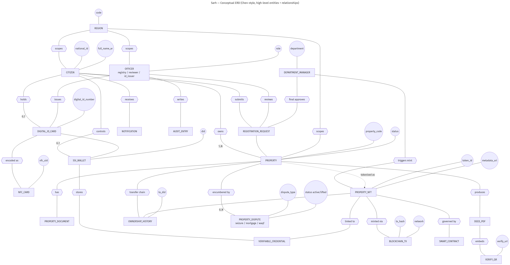
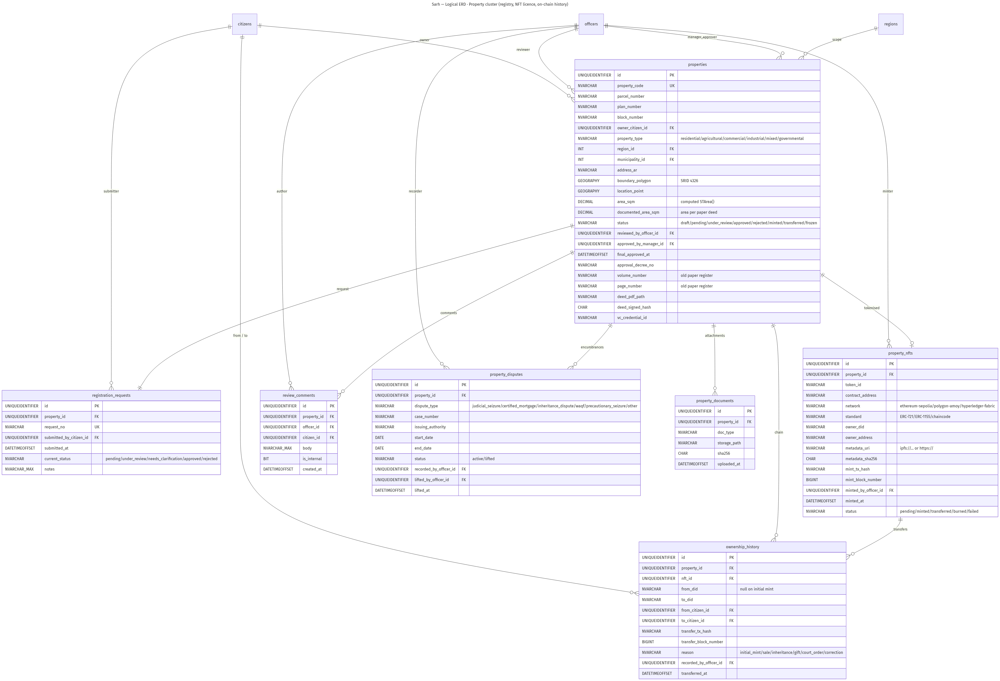
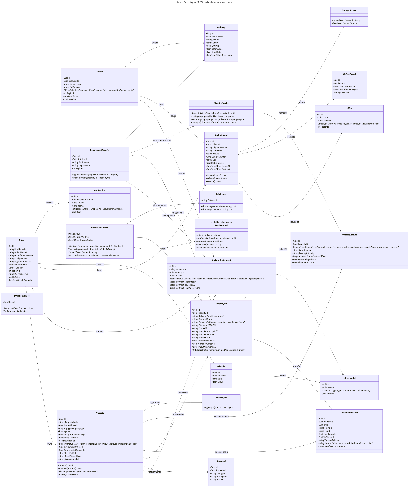
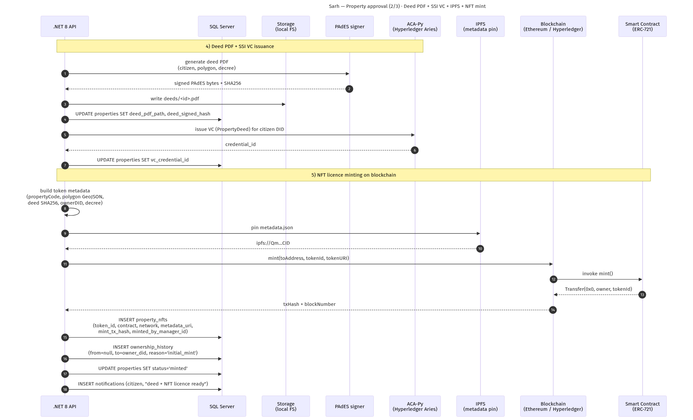

<div dir="rtl">

# صَرح — مراجعة تقنية: طبقة البلوكتشين والمخططات (المفاهيمي / المنطقي UML / الفئات)

> **الغرض من هذه الوثيقة:** وثيقة مكتفية بذاتها للمراجع تجمع — في ملف واحد — المخطط
> المفاهيمي (Conceptual ERD)، والمخطط المنطقي (Logical ERD / UML)، ومخطط الفئات
> (Class Diagram)، مع **شرح كامل ومرجعية الكود** لكيفية اعتماد الأرض على البلوكتشين
> (سكّ رخصة NFT). أُنشئت هذه الوثيقة لأن طبقة البلوكتشين وكودها لم تظهر في نسخة
> سابقة سُلِّمت للمراجعة، رغم أنها **موجودة بالكامل** في المستودع.

---

## ٠. ملخص للمراجع (الإجابة المباشرة)

١. **كود البلوكتشين موجود وكامل** داخل المستودع، وليس ناقصاً. (انظر خريطة الملفات في القسم ١.)

٢. **«اعتماد أرض على البلوكتشين»** في صَرح يعني: **سكّ رخصة ملكية رقمية كـ NFT** بمعيار
   **ERC-721**. تتم العملية في الدالة `LicenseService.FinalApproveAsync`
   (`apps/api-dotnet/Workflow/LicenseService.cs`) عند الاعتماد النهائي لعقار حالته `approved`.

٣. **طبقة السلسلة مُجرّدة خلف واجهة** `IBlockchainService`. التنفيذ الحالي الافتراضي هو
   **Stub حتمي** (مناسب للتطوير والعرض دون عقدة RPC أو رسوم غاز)، وهو **قابل للاستبدال
   بتنفيذ Ethereum حقيقي (Nethereum)** دون تغيير أي سطر في طبقة الخدمات أو قاعدة البيانات.
   هذا تصميم متعمّد (Strategy / Ports & Adapters)، وهو موثَّق في تعليقات الكود نفسه.

٤. **سجل الملكية على السلسلة** يُمثَّل في جدولين: `property_nfts` (الرابط بين العقار وهويته
   على السلسلة) و`ownership_history` (سلسلة حيازة **للإضافة فقط** — مُنع عليها `UPDATE/DELETE`
   بمشغّلات قاعدة بيانات). كلاهما عُرِّف في الترحيل `028_property_nfts_ownership_history.sql`.

> **ملاحظة أمانة علمية:** ما هو مُنفَّذ ويعمل اليوم هو طبقة السلسلة بنمط Stub حتمي + نموذج
> البيانات الكامل + خط الإنتاج الكامل (سكّ، نقل، تحقّق). التنفيذ الفعلي على شبكة إيثيريوم
> حيّة (Sepolia/Mainnet) هو **نقطة تبديل موثَّقة** (تغيير إعداد + إضافة حزمة `Nethereum.Web3`)
> ولم يُفعّل بعد. التفصيل في القسم ٢.١١.

---

## ١. خريطة كود البلوكتشين (أين يقع كل شيء)

كل ما يخصّ البلوكتشين يقع في مكانين رئيسيين داخل خدمة الـ API (.NET 8):

| المسار | النوع | الغرض |
|--------|-------|-------|
| `apps/api-dotnet/Blockchain/IBlockchainService.cs` | واجهة | عقد طبقة السلسلة: `MintAsync` / `TransferAsync` / `OwnerOfAsync` + روابط المستكشف. يُعرِّف كذلك `IIpfsService`. |
| `apps/api-dotnet/Blockchain/StubBlockchainService.cs` | تنفيذ | بديل حتمي داخل العملية: يشتقّ `tokenId` و`txHash` من SHA-256 لمعرّف العقار + DID المالك. |
| `apps/api-dotnet/Blockchain/StubIpfsService.cs` | تنفيذ | بديل IPFS: يخزّن `metadata.json` على القرص ويُرجع `ipfs://<cid>` (الـ CID = تجزئة المحتوى). |
| `apps/api-dotnet/Blockchain/PropertyLicenseMetadata.cs` | نموذج | مخطط ميتاداتا الرمز (EIP-721 / OpenSea) + امتداد `sarh` (مضلّع GeoJSON، رقم القرار، تجزئة الصكّ…). |
| `apps/api-dotnet/Blockchain/BlockchainOptions.cs` | إعدادات | قسم `Sarh:Blockchain` و`Sarh:Ipfs`: الوضع (stub/ethereum)، الشبكة، عنوان العقد، RpcUrl، مفتاح الساكّ المُعمّى. |
| `apps/api-dotnet/Workflow/LicenseService.cs` | خدمة | **قلب الاعتماد على البلوكتشين**: سكّ الرخصة (`FinalApproveAsync`). |
| `apps/api-dotnet/Workflow/TransferService.cs` | خدمة | نقل ملكية رمز موجود إلى مواطن آخر (بيع/إرث/قرار محكمة…). |
| `apps/api-dotnet/Workflow/NftsService.cs` | خدمة | قراءة سجلّ الرخص + سلسلة الحيازة (للمدير/المدقّق/المواطن). |
| `apps/api-dotnet/Controllers/PropertiesController.cs` | مسارات | `POST /api/v1/properties/{id}/final-approve` → السكّ. |
| `apps/api-dotnet/Controllers/NftsController.cs` | مسارات | `POST /api/v1/property-nfts/{id}/transfer` → النقل. |
| `apps/api-dotnet/Controllers/MeController.cs` | مسارات | `GET /api/v1/me/nfts` → رخص المواطن. |
| `apps/api-dotnet/Data/Entities/PropertyNft.cs` + `OwnershipHistory.cs` | كيانات | كيانات EF Core المُسقَطة على الجدولين. |
| `infra/mssql/migrations/028_property_nfts_ownership_history.sql` | ترحيل | إنشاء `property_nfts` + `ownership_history` + قيود + مشغّلات الإضافة-فقط. |
| `apps/api-dotnet/Program.cs` (الأسطر ١٠٨–١٢٥) | تسجيل DI | حقن `IBlockchainService` و`IIpfsService` وربط أقسام الإعدادات. |
| `packages/shared-types/src/index.ts` | أنواع | أنواع TypeScript للرخصة على الواجهة (NFT/OwnershipEvent). |
| `apps/web/src/app/core/nfts.service.ts` + صفحات `admin/nft-licences*` | واجهة | عرض الرخص وسلسلة الحيازة وروابط المستكشف للمستخدم. |

---

## ٢. كيف تُعتمد أرض على البلوكتشين (التدفّق الكامل + الكود)

### ٢.١ نظرة عامة على المسار

اعتماد الأرض على السلسلة هو **الخطوة الأخيرة** في دورة حياة العقار، بعد المراجعة الفنية
والاعتماد. التسلسل الكامل للحالة:

```
draft → pending → under_review → approved → minted → (transferred)*
```

السكّ نفسه يحدث عند الانتقال من `approved` إلى `minted`، وينفّذ التالي بالترتيب داخل
`LicenseService.FinalApproveAsync`:

1. التحقق من الصلاحية والنطاق الجغرافي للطالب.
2. **فحص العَوْد (Idempotency):** إن وُجدت رخصة غير فاشلة للعقار → تُعاد كما هي بلا سكّ مكرَّر.
3. التأكد أن حالة العقار `approved` (اعتمدها موظف السجل وصدر الصكّ والاعتماد بـ VC).
4. **بوابة أمنية:** رفض السكّ إن كان على العقار نزاع/حجز نشِط (`AssertNoActiveDisputeAsync`).
5. **بناء الميتاداتا** (اسم، وصف، سمات، امتداد `sarh` يضمّ مضلّع GeoJSON ورقم القرار وتجزئة الصكّ).
6. **تثبيت الميتاداتا على IPFS** → الحصول على `ipfs://<cid>` + `sha256`.
7. **السكّ على السلسلة** عبر `chain.MintAsync(...)` → إيصال يضمّ `tokenId`, `contractAddress`,
   `network`, `txHash`, `blockNumber`, `ownerAddress`.
8. **الحفظ في قاعدة البيانات** ضمن `SaveChanges` واحدة: صفّ في `property_nfts` (حالة `minted`)
   + صفّ أول في `ownership_history` (`from=null`, `reason='initial_mint'`).
9. تحديث حالة العقار إلى `minted` + ختم المُعتمِد وتاريخ الاعتماد النهائي ورقم القرار.
10. **إشعار المواطن** بأن رخصة عقاره صدرت على البلوكتشين (مع `tokenId` ورابط المستكشف).

### ٢.٢ الشروط المسبقة والبوّابات الأمنية

```csharp
// LicenseService.FinalApproveAsync — الشروط قبل السكّ
// 1) فحص العَوْد: لا نسكّ رمزاً مكرَّراً لعقار له رمز قائم.
var existing = await db.PropertyNfts
    .FirstOrDefaultAsync(n => n.PropertyId == property.Id && n.Status != "failed", ct);
if (existing is not null)
    return await BuildResultAsync(property, existing, ct);

// 2) لا سكّ قبل اعتماد موظف السجل.
if (property.Status != "approved")
    throw SarhException.Conflict("لا يمكن سكّ الرخصة قبل اعتماد موظف السجل …");

// 3) بوابة أمنية: لا سكّ لعقار عليه نزاع/حجز نشِط (حجز محكمة، رهن، وقف…).
await disputes.AssertNoActiveDisputeAsync(property.Id, ct);
```

### ٢.٣ بناء ميتاداتا الرخصة (المرساة خارج السلسلة)

الميتاداتا تُخزَّن **خارج السلسلة** (IPFS) وتُرسى تجزئتها **على السلسلة** عبر `tokenURI`.
المخطط يتبع عُرف EIP-721 / OpenSea ليقرأه أي محفظة أو مستكشف، مع امتداد `sarh` يحمل
البيانات الخاصة بالسجل (المضلّع الجغرافي، رقم القرار، تجزئة الصكّ، رابط التحقق):

```csharp
// LicenseService.BuildMetadata — المقتطف الجوهري
return new PropertyLicenseMetadata
{
    Name        = $"رخصة عقار صَرح · {p.PropertyCode}",
    Description = $"رخصة ملكية عقارية رقمية صادرة من سجل العقارات الليبي · صاحب الحق: {ownerName}.",
    Image       = $"{verifyUrl}/preview.png",
    ExternalUrl = verifyUrl,
    Attributes  = new() { /* Property Code, Type, Region, Area, Decree, Approved At */ },
    Sarh = new SarhExtension
    {
        PropertyId     = p.Id,
        PropertyCode   = p.PropertyCode,
        OwnerDid       = ownerDid,
        DecreeNo       = decree,
        ApprovedAt     = approvedAt,
        DeedSha256     = p.DeedSignedHash ?? "",   // ربط رخصة السلسلة بالصكّ الموقَّع PAdES
        PolygonGeoJson = polygon,                   // مضلّع الأرض RFC 7946 مضمَّنًا في الميتاداتا
        VerifyUrl      = verifyUrl,
    },
};
```

### ٢.٤ تثبيت الميتاداتا على IPFS وتجزئتها

```csharp
var metaJson = JsonSerializer.Serialize(metadata, …);
var pin = await ipfs.PinJsonAsync(metaJson, ct);   // → { IpfsUri = "ipfs://<cid>", Sha256 }
```

في وضع التطوير، `StubIpfsService` يحسب `sha256` للمحتوى، يصوغ CID زائفًا مستقرًّا
(`bafk + sha256[..52]`)، ويخزّن الملف تحت دلو `ipfs-stub` على القرص ليخدمه مسار التحقق.
الانتقال إلى مثبِّت حقيقي (Pinata / web3.storage) = تنفيذ بديل لنفس الواجهة `IIpfsService`.

### ٢.٥ السكّ على السلسلة عبر `IBlockchainService`

العقد الموحَّد للسكّ — لا يفرّق المستدعي بين Stub وEthereum:

```csharp
// IBlockchainService — الواجهة المجرّدة
public interface IBlockchainService
{
    string Network { get; }
    string Standard { get; }            // "ERC-721"
    string ContractAddress { get; }
    Task<MintReceipt>     MintAsync(MintRequest request, CancellationToken ct);
    Task<TransferReceipt> TransferAsync(TransferRequest request, CancellationToken ct);
    Task<string?>         OwnerOfAsync(string tokenId, CancellationToken ct);   // ownerOf على السلسلة
    string ExplorerTxUrl(string txHash);
    string ExplorerTokenUrl(string tokenId);
}
```

نداء السكّ من خدمة الرخص:

```csharp
var receipt = await chain.MintAsync(new MintRequest
{
    PropertyId     = property.Id,
    OwnerDid       = ownerDid,
    TokenUri       = pin.IpfsUri,      // tokenURI يشير إلى ميتاداتا IPFS
    MetadataSha256 = pin.Sha256,       // المرساة المقاومة للتلاعب
}, ct);
```

التنفيذ الحتمي (تطوير) يولّد `tokenId` كـ `uint256` (سلسلة عشرية) و`txHash` بطول رمز
إيثيريوم حقيقي، مشتقّين من تجزئة `propertyId | ownerDid | metadataSha256` — فيبقى الناتج
ثابتًا لنفس العقار ويصلح للاختبارات الآلية:

```csharp
// StubBlockchainService.MintAsync — المقتطف الجوهري
var seed = $"{req.PropertyId:N}|{req.OwnerDid}|{req.MetadataSha256}";
var tokenIdBytes = SHA256.HashData(Encoding.UTF8.GetBytes($"token:{seed}"));
var tokenId = new BigInteger(tokenIdBytes, isUnsigned: true, isBigEndian: true).ToString();
var txHash  = "0x" + HashHex($"tx:{seed}", 64);
// → MintReceipt { TokenId, ContractAddress, Network, Standard, OwnerDid, OwnerAddress, TxHash, BlockNumber, MintedAt }
```

### ٢.٦ حفظ سجل الملكية في قاعدة البيانات

بعد نجاح السكّ، يُكتب صفّ الرخصة + الصفّ الأول من سلسلة الحيازة، ثم تُحدَّث حالة العقار،
كلّها في حفظ واحد:

```csharp
db.PropertyNfts.Add(new PropertyNft {
    PropertyId = property.Id, TokenId = receipt.TokenId,
    ContractAddress = receipt.ContractAddress, Network = receipt.Network,
    Standard = receipt.Standard, OwnerDid = receipt.OwnerDid, OwnerAddress = receipt.OwnerAddress,
    MetadataUri = pin.IpfsUri, MetadataSha256 = pin.Sha256,
    MintTxHash = receipt.TxHash, MintBlockNumber = receipt.BlockNumber,
    MintedByOfficerId = actor.OfficerId, MintedAt = receipt.MintedAt, Status = "minted",
});

db.OwnershipHistory.Add(new OwnershipHistory {
    PropertyId = property.Id, NftId = nft.Id,
    FromDid = null, ToDid = ownerDid,            // أول صفّ: من = لا أحد
    FromCitizenId = null, ToCitizenId = owner.Id,
    TransferTxHash = receipt.TxHash, TransferBlockNumber = receipt.BlockNumber,
    Reason = "initial_mint", RecordedByOfficerId = actor.OfficerId,
    TransferredAt = receipt.MintedAt,
});

property.Status = "minted";
property.ApprovedByManagerId = actor.OfficerId;
property.FinalApprovedAt = finalApprovedAt;
await db.SaveChangesAsync(ct);
```

> **ملاحظة تصميمية صريحة في الكود:** الملكية القانونية تبقى مُتتبَّعة عبر
> `properties.owner_citizen_id`؛ الـ NFT **مرآة قابلة للتحقّق** وليس بديلاً قانونيًا.
> أيّ تغيير في المالك يجب أن يُرفق بصفّ في `ownership_history` (مفروض في طبقة الخدمة).

### ٢.٧ اشتقاق هوية المالك (DID)

```csharp
private static string OwnerDidFor(Citizen c)
{
    // DID مؤقت مستقرّ مشتقّ من لاحقة معرّف المواطن، إلى أن يُربط جدول ssi_wallets.
    var hex = c.Id.ToString("N");
    return $"did:sov:LY:{hex[^16..]}";
}
```

نُقرِن دائمًا الـ DID (هوية W3C خارج السلسلة) بعنوان على السلسلة (`owner_address`)، فتبقى
عمليات التحقق بالهوية الذاتية (SSI) صالحة حتى بعد تدوير المحفظة.

### ٢.٨ نقل الملكية لاحقًا (`TransferService`)

بيع/إرث/هبة/قرار محكمة/تصحيح إداري ينفّذها `POST /api/v1/property-nfts/{id}/transfer`:
نداء `chain.TransferAsync` ثم تحديث ثلاثة مواضع في حفظ واحد —
`property_nfts` (المالك الجديد + حالة `transferred`)، و`ownership_history` (صفّ جديد)،
و`properties.owner_citizen_id` (المالك القانوني). تُفرض نفس البوابة الأمنية (لا نقل لعقار
عليه نزاع نشِط) ويُطلب سبب صالح + ملاحظة إلزامية لقرار المحكمة/التصحيح.

### ٢.٩ التحقّق العام (verify + `ownerOf` على السلسلة)

`GET /api/v1/verify/{code}` يقرأ بيانات العقار + تجزئة التحقق + الرمز، ثم يستعلم
`chain.OwnerOfAsync(tokenId)` ليُظهر **المالك الحيّ على السلسلة** الذي قد يختلف عن السجل بعد
نقل خارجه — فيُكشف أي انحراف للعموم.

### ٢.١٠ المسارات (REST) وتسجيل الخدمات (DI)

| الفعل | المسار | الخدمة |
|------|--------|--------|
| `POST` | `/api/v1/properties/{id}/final-approve` | `LicenseService.FinalApproveAsync` (السكّ) |
| `POST` | `/api/v1/properties/bulk-final-approve` | سكّ جماعي |
| `POST` | `/api/v1/property-nfts/{id}/transfer` | `TransferService.TransferAsync` (النقل) |
| `GET`  | `/api/v1/property-nfts` | `NftsService.ListAsync` (سجلّ الرخص) |
| `GET`  | `/api/v1/property-nfts/{id}/history` | `NftsService.ListHistoryAsync` (سلسلة الحيازة) |
| `GET`  | `/api/v1/me/nfts` | `NftsService.ListMyAsync` (رخص المواطن) |

```csharp
// Program.cs — حقن طبقة السلسلة و IPFS (افتراضيًا Stub)
builder.Services.Configure<BlockchainOptions>(builder.Configuration.GetSection(BlockchainOptions.SectionName));
builder.Services.Configure<IpfsOptions>(builder.Configuration.GetSection(IpfsOptions.SectionName));
builder.Services.AddSingleton<IBlockchainService, StubBlockchainService>();
builder.Services.AddSingleton<IIpfsService,       StubIpfsService>();
```

### ٢.١١ حالة التنفيذ: Stub مقابل Ethereum — وكيف ننتقل للإنتاج

التصميم يعزل «ماذا» (سكّ/نقل/قراءة مالك) عن «كيف» (سلسلة فعلية أم بديل). للانتقال للإنتاج
على إيثيريوم (موثَّق حرفيًا في تعليقات `BlockchainOptions.cs`):

1. ضبط `Sarh:Blockchain:Mode = "ethereum"`.
2. تعبئة `RpcUrl` (Infura/Alchemy أو عقدة Anvil/Hardhat محلية) و`ContractAddress`
   و`MinterPrivateKeyEnc` (مفتاح الساكّ مُعمّى بـ KMS — لا يُخزَّن صريحًا أبدًا).
3. إضافة حزمة `Nethereum.Web3` وتنفيذ `EthereumBlockchainService : IBlockchainService`
   (ينادي دوال العقد `mint` / `safeTransferFrom` / `ownerOf`).
4. تبديل سطر التسجيل في `Program.cs` إلى التنفيذ الجديد — **لا يتغير أي شيء آخر** في
   `LicenseService` أو `TransferService` أو قاعدة البيانات أو الواجهة.

الشبكات المسموح بها في `ck_nft_network` جاهزة مسبقًا:
`ethereum-mainnet`, `ethereum-sepolia`, `polygon-mainnet`, `polygon-amoy`, `hyperledger-fabric`.

---

## ٣. نموذج بيانات البلوكتشين (الترحيل 028)

```sql
-- property_nfts: الرابط (نظام التسجيل) بين العقار وهويته على السلسلة
CREATE TABLE property_nfts (
    id               UNIQUEIDENTIFIER PRIMARY KEY DEFAULT NEWID(),
    property_id      UNIQUEIDENTIFIER NOT NULL REFERENCES properties(id),
    token_id         NVARCHAR(80)  NOT NULL,           -- uint256 كنص (تفادي الفيض)
    contract_address NVARCHAR(80)  NOT NULL,
    network          NVARCHAR(40)  NOT NULL CHECK (network IN (…)),
    standard         NVARCHAR(24)  NOT NULL DEFAULT N'ERC-721',
    owner_did        NVARCHAR(160) NOT NULL,           -- هوية W3C خارج السلسلة
    owner_address    NVARCHAR(80)  NULL,               -- العنوان على السلسلة
    metadata_uri     NVARCHAR(255) NOT NULL,           -- ipfs://<cid>
    metadata_sha256  CHAR(64)      NOT NULL,           -- المرساة المقاومة للتلاعب
    mint_tx_hash     NVARCHAR(80)  NOT NULL,
    mint_block_number BIGINT       NULL,
    status           NVARCHAR(16)  NOT NULL CHECK (status IN
                     (N'pending', N'minted', N'transferred', N'burned', N'failed')),
    …
);
-- رمز واحد لكل عقار (فهرس فريد مُرشَّح على الحالات النشطة)
CREATE UNIQUE INDEX ux_nft_property ON property_nfts(property_id)
    WHERE status IN (N'pending', N'minted', N'transferred');

-- ownership_history: سلسلة حيازة للإضافة فقط (مثل audit_log)
CREATE TRIGGER tr_ownership_history_no_update ON ownership_history
INSTEAD OF UPDATE AS BEGIN RAISERROR(N'append-only; UPDATE not permitted.',16,1); END
CREATE TRIGGER tr_ownership_history_no_delete ON ownership_history
INSTEAD OF DELETE AS BEGIN RAISERROR(N'append-only; DELETE not permitted.',16,1); END
```

**النقاط التي يُنصح المراجع بالتدقيق فيها:** (أ) فصل الهوية القانونية عن مرآة السلسلة؛
(ب) الإضافة-فقط على سلسلة الحيازة بمشغّلات (لا بالاتفاق فقط)؛ (ج) المرساة بالتجزئة
(`metadata_sha256`) لمقاومة التلاعب؛ (د) فريدية الرمز لكل عقار عبر فهرس مُرشَّح.

---

## ٤. المخطط المفاهيمي (Conceptual ERD)

نظرة عالية المستوى (نمط Chen) للكيانات والعلاقات. كيانات البلوكتشين مُبرزة:
`PROPERTY_NFT`، `OWNERSHIP_HISTORY`، `BLOCKCHAIN_TX`، `SMART_CONTRACT`.

<figure>
  
  <figcaption>المخطط المفاهيمي — المصدر: <code>docs/diagrams/conceptual-erd.mmd</code></figcaption>
</figure>

علاقات البلوكتشين في هذا المخطط: `DEPARTMENT_MANAGER —(triggers mint)→ PROPERTY_NFT`،
و`PROPERTY —(tokenised as)→ PROPERTY_NFT`، و`PROPERTY_NFT —(minted via)→ BLOCKCHAIN_TX`،
و`PROPERTY_NFT —(governed by)→ SMART_CONTRACT`، و`PROPERTY_NFT —⟶ OWNERSHIP_HISTORY`
(سلسلة النقل)، و`PROPERTY_NFT —(linked to)→ VERIFIABLE_CREDENTIAL`.

---

## ٥. المخطط المنطقي (Logical ERD / UML)

المخطط الكامل بالجداول والمفاتيح (PK/FK/UQ). نظراً لحجمه، يُصيَّر مقسَّماً إلى ثلاث لوحات
(الهوية / العقارات / النظام) — مصدرها الموحَّد `docs/diagrams/db-schema.mmd`. اللوحة الخاصة
بالعقارات أدناه تُظهر **جدولَي البلوكتشين** `property_nfts` و`ownership_history` بكامل أعمدتهما
وعلاقاتهما بـ `properties` و`citizens` و`officers`.

<figure>
  
  <figcaption>المخطط المنطقي — لوحة العقارات والبلوكتشين (property_nfts + ownership_history). المصدر: <code>docs/diagrams/db-schema.mmd</code></figcaption>
</figure>

> اللوحتان الأخريان: الهوية الرقمية `docs/diagrams/db-schema-identity.png`، والنظام/التدقيق
> `docs/diagrams/db-schema-system.png`. والمخطط المنطقي الكامل بصيغة نصية في `db-schema.mmd`.

العلاقات الجوهرية للبلوكتشين على المستوى المنطقي:

- `properties ||--o| property_nfts` — لكل عقار رمز واحد كحدّ أقصى («tokenised»).
- `property_nfts ||--o{ ownership_history` — لكل رمز سلسلة تحويلات.
- `officers ||--o{ property_nfts` — الموظف الساكّ («minter»).
- `citizens ||--o{ ownership_history` — طرفا التحويل (from / to).

---

## ٦. مخطط الفئات (Class Diagram)

نطاق الـ .NET 8 + طبقة البلوكتشين. الفئات ذات الصلة:
`BlockchainService`، `SmartContract` («solidity / chaincode»)، `IpfsService`،
`PropertyNft`، `OwnershipHistory`، إضافةً إلى `DepartmentManager.TriggerNftMint(...)`.

<figure>
  
  <figcaption>مخطط الفئات — المصدر: <code>docs/diagrams/class-diagram.mmd</code></figcaption>
</figure>

تخطيط الفئات على الكود الفعلي:

| فئة المخطط | الكود الفعلي |
|------------|--------------|
| `BlockchainService` | واجهة `IBlockchainService` + تنفيذ `StubBlockchainService` (و`EthereumBlockchainService` مستقبلاً). |
| `IpfsService` | واجهة `IIpfsService` + تنفيذ `StubIpfsService`. |
| `SmartContract` | عقد ERC-721 الخارجي (Solidity) / Chaincode — تُنادى دواله `mint/safeTransferFrom/ownerOf`. |
| `PropertyNft` / `OwnershipHistory` | كيانات EF Core على الجدولين. |
| `DepartmentManager.TriggerNftMint` | `LicenseService.FinalApproveAsync`. |

---

## ٧. مخطط التسلسل لعملية السكّ (للسياق)

يوضّح المرحلتين ٤ و٥: إصدار الصكّ PAdES + اعتماد VC، ثم تثبيت الميتاداتا على IPFS والسكّ على
السلسلة وكتابة `property_nfts` + `ownership_history`.

<figure>
  
  <figcaption>تسلسل السكّ — المصدر: <code>docs/diagrams/sequence-property-mint.mmd</code></figcaption>
</figure>

التسلسل الكامل من التقديم حتى التحقق متاح في `docs/diagrams/sequence-property-approval.mmd`.

---

## ٨. خلاصة للمراجع

- **البلوكتشين ليس ناقصًا:** الكود ونموذج البيانات والمسارات والمخططات كلّها موجودة (الأقسام ١–٦).
- **اعتماد الأرض على السلسلة = سكّ رخصة ERC-721** عبر `LicenseService.FinalApproveAsync`،
  مرساةً بميتاداتا IPFS مجزّأة، ومسجَّلةً في `property_nfts` + `ownership_history`.
- **التصميم قابل للإنتاج:** طبقة سلسلة مجرّدة (Stub اليوم، Ethereum/Nethereum بتبديل إعداد)،
  مع فصل الملكية القانونية عن مرآة السلسلة، وسلسلة حيازة للإضافة-فقط، ومرساة مقاومة للتلاعب.

> **ملفات مرجعية:** كود السلسلة `apps/api-dotnet/Blockchain/*` — خدمات السكّ/النقل
> `apps/api-dotnet/Workflow/{LicenseService,TransferService,NftsService}.cs` — المخطط
> `infra/mssql/migrations/028_property_nfts_ownership_history.sql` — الرسوم `docs/diagrams/`.

</div>
