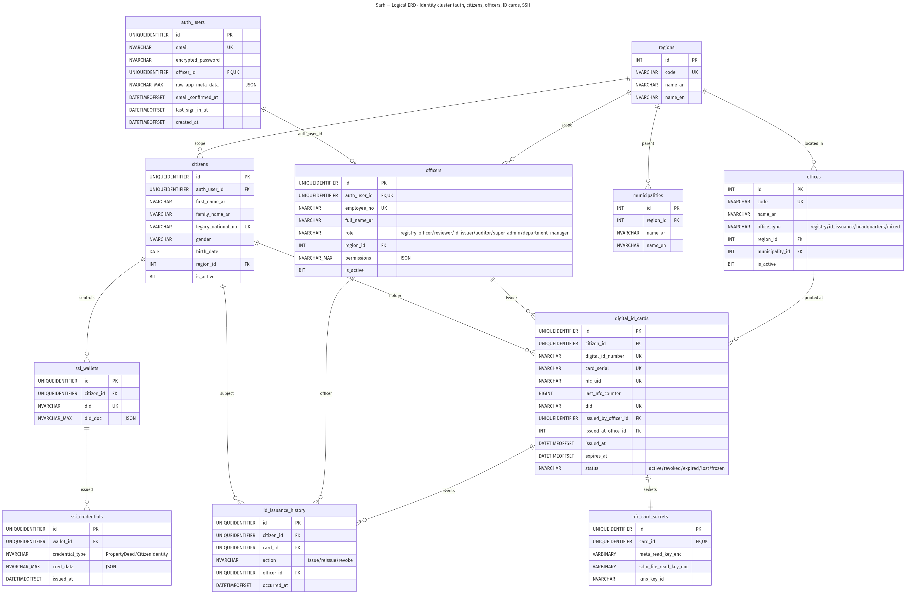
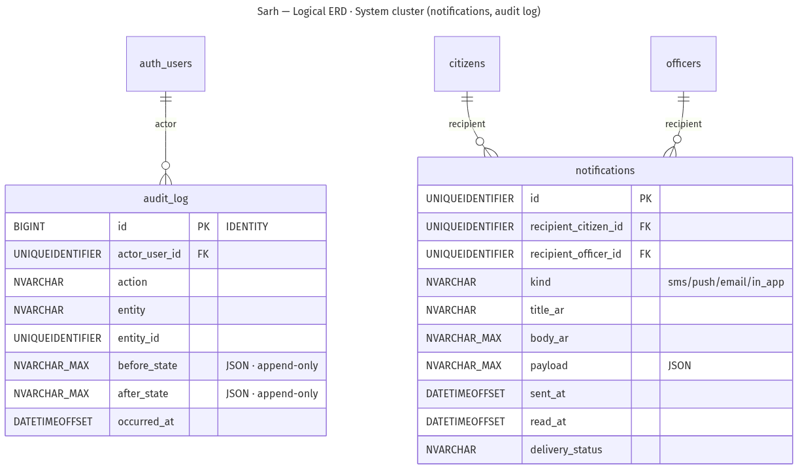

# صَرح — توثيق النمذجة: المخطط المفاهيمي والمنطقي (UML) ومخطط الفئات

> **الوثيقة:** توثيق نمذجة كامل لمشروع منصّة صَرح، يغطّي المخططات الثلاثة المطلوبة —
> المخطط المفاهيمي (Conceptual ERD)، والمخطط المنطقي (Logical ERD / UML)، ومخطط الفئات
> (Class Diagram) — مع قاموس بيانات كامل لكل الجداول، ومصفوفة تتبّع تربط النماذج بالكود
> وملفات الترحيل. مصدر الحقيقة للمخطط هو ترحيلات T-SQL المرقّمة في
> `infra/mssql/migrations/000…046.sql` وكيانات EF Core في `apps/api-dotnet/Data/Entities/`.

---

## ٠. تمهيد ونطاق التوثيق

- **الاسم:** صَرح (Sarh) — منصّة السجل العقاري الليبي + إصدار الهوية الرقمية.
- **الجهة المالكة:** الرؤية الليبية للاتصالات والتقنية (LVCT).
- **المستخدمون:** المواطنون، موظفو السجل، المراجعون، مديرو الإدارة، موظفو إصدار الهوية،
  مدراء النظام، والمتحقّقون العموميون.
- **نطاق هذه الوثيقة:** نمذجة البيانات (المفاهيمي + المنطقي) ونمذجة البرمجيات (مخطط الفئات)،
  مع قاموس بيانات تفصيلي. لتفاصيل المعمارية والأمان راجع `docs/project/03-architecture-and-design.ar.md`،
  ولتفاصيل البلوكتشين راجع `docs/project/07-blockchain-erd-class-review.ar.md`.

### منهجية النمذجة (المستويات الثلاثة)

| المستوى | السؤال الذي يجيب عنه | درجة التجريد | المخطط في صَرح |
|---------|----------------------|---------------|------------------|
| **المفاهيمي (Conceptual)** | ما الكيانات الرئيسية وكيف ترتبط؟ | عالٍ — بلا أنواع بيانات | المخطط المفاهيمي (نمط Chen) |
| **المنطقي (Logical / UML)** | ما الجداول والأعمدة والمفاتيح؟ | متوسط — مستقل عن محرّك بعينه | المخطط المنطقي (ER كامل) + قاموس البيانات |
| **مخطط الفئات (Class)** | كيف يُمثَّل النطاق في الكود الكائني؟ | تنفيذي — فئات .NET 8 وخدماتها | Class Diagram |

---

## ١. نظرة عامة معمارية (سياق المشروع الكامل)

ثلاث طبقات رئيسية:

1. **الواجهة (Web):** تطبيق Angular 21 واحد (`apps/web/`) يجمع أدوار المواطن/الموظف/مُصدِر
   الهوية/المدير/التحقّق خلف توجيه قائم على الدور، عربي أولاً (RTL). يوجد كذلك تطبيق Flutter للهاتف.
2. **الخلفية (API):** خدمة ASP.NET Core 8 (`apps/api-dotnet/`) موزّعة على وحدات:
   `Auth`, `Citizens`, `DigitalIdCards`, `Properties`, `Workflow` (مراجعة/سكّ/نقل/صكّ),
   `Disputes`, `Map`, `Ssi`, `Blockchain`, `Notifications`, `Verify`, `Reports`, `Audit`, `Storage`.
3. **التخزين والخدمات:** SQL Server 2019/2022 (نوع `geography` للهندسة، فهرس عربي للبحث،
   مشغّلات `INSTEAD OF` لسجلّ التدقيق غير القابل للتعديل)، وكيل هوية ذاتية ACA-Py (Hyperledger
   Aries)، وطبقة بلوكتشين مجرّدة (Stub قابل للاستبدال بـ Ethereum)، وتخزين ملفات محلي.

تتوزّع كيانات قاعدة البيانات على **ثلاث عناقيد** نمذجها هذه الوثيقة: عنقود **الهوية**
(الحسابات، المواطنون، الموظفون، البطاقات، المحافظ)، وعنقود **العقارات** (السجل، الوثائق،
الرخص على السلسلة، سلسلة الحيازة، النزاعات)، وعنقود **النظام** (الإشعارات، سجلّ التدقيق).

---

## ٢. المخطط المفاهيمي (Conceptual ERD)

عرض عالي المستوى (نمط Chen): الكيانات مستطيلات، والعلاقات معيّنات، والسمات المفتاحية دوائر.

<figure>
  
  <figcaption>المخطط المفاهيمي — المصدر: <code>docs/diagrams/conceptual-erd.mmd</code></figcaption>
</figure>

### ٢.١ الكيانات الرئيسية

| الكيان | الوصف |
|--------|-------|
| CITIZEN | المواطن الليبي (شخص طبيعي)؛ يحمل `legacy_national_no` لإعادة الإصدار بلا فقد بيانات. |
| OFFICER | موظف صَرح؛ دوره يحدّد الصلاحيات (سجل/مراجع/مُصدِر هوية/مدقّق/مدير نظام). |
| DEPARTMENT_MANAGER | مدير الإدارة؛ الاعتماد النهائي وإطلاق سكّ الرخصة. |
| PROPERTY | العقار/القطعة المساحية؛ مساحته مشتقّة من المضلّع `STArea()`. |
| REGISTRATION_REQUEST | مظروف دورة حياة طلب التسجيل وحالاته. |
| PROPERTY_DOCUMENT | مرفقات إثبات العقار (صورة موقع + كروكي إلزاميان). |
| PROPERTY_DISPUTE | عبء قانوني على العقار (حجز/رهن/نزاع ورثة/وقف)؛ صفّ نشِط يمنع السكّ والنقل. |
| DIGITAL_ID_CARD | بطاقة الهوية الرقمية NFC للمواطن. |
| NFC_CARD | الترميز الفيزيائي للبطاقة (NTAG 424 DNA + عدّاد متدحرج). |
| SSI_WALLET | محفظة الهوية الذاتية للمواطن (DID). |
| VERIFIABLE_CREDENTIAL | اعتماد قابل للتحقّق (صكّ عقار/هوية مواطن). |
| DEED_PDF | صكّ PDF موقّع PAdES يحوي QR للتحقّق. |
| VERIFY_QR | رمز QR يشير إلى `verify.sarh.ly/{code}`. |
| PROPERTY_NFT | رخصة الملكية المسكوكة على السلسلة (ERC-721). |
| OWNERSHIP_HISTORY | سلسلة حيازة للإضافة فقط (سكّ أوّلي + كل نقل). |
| BLOCKCHAIN_TX / SMART_CONTRACT | معاملة السلسلة والعقد الذكي الذي يحكم الرمز. |
| REGION | المحافظة (نطاق الصلاحية الجغرافي). |
| NOTIFICATION / AUDIT_ENTRY | الإشعارات وسجلّ التدقيق غير القابل للتعديل. |

### ٢.٢ أهم العلاقات وتعدّديتها (Cardinality)

| العلاقة | الطرفان | التعدّدية |
|---------|---------|-----------|
| يملك | CITIZEN → PROPERTY | 1..N |
| يحمل | CITIZEN → DIGITAL_ID_CARD | 0..1 |
| يتحكّم | CITIZEN → SSI_WALLET | 0..1 |
| يقدّم | CITIZEN → REGISTRATION_REQUEST | 1..N |
| يراجع | OFFICER → REGISTRATION_REQUEST | 1..N |
| يُصدر | OFFICER → DIGITAL_ID_CARD | 1..N |
| يعتمد نهائياً | DEPARTMENT_MANAGER → REGISTRATION_REQUEST | 1..N |
| يُطلق السكّ | DEPARTMENT_MANAGER → PROPERTY_NFT | 1..N |
| له وثائق | PROPERTY → PROPERTY_DOCUMENT | 1..N |
| عليه عبء | PROPERTY → PROPERTY_DISPUTE | 0..N |
| يُرمَّز كـ | PROPERTY → PROPERTY_NFT | 0..1 |
| سلسلة نقل | PROPERTY/PROPERTY_NFT → OWNERSHIP_HISTORY | 1..N |
| يُسكّ عبر | PROPERTY_NFT → BLOCKCHAIN_TX | 1..N |
| مرتبط بـ | PROPERTY_NFT → VERIFIABLE_CREDENTIAL | 0..1 |
| يُرمَّز فيزيائياً | DIGITAL_ID_CARD → NFC_CARD | 1..1 |
| يخزّن | SSI_WALLET → VERIFIABLE_CREDENTIAL | 1..N |
| يحدّ نطاق | REGION → CITIZEN/OFFICER/PROPERTY | 1..N |

---

## ٣. المخطط المنطقي (Logical ERD / UML)

النموذج العلائقي الكامل بالجداول والأعمدة والمفاتيح (PK / FK / UK). نظراً لحجمه (٢٠ جدولاً)
يُعرَض في ثلاث لوحات حسب العنقود؛ مصدرها الموحَّد `docs/diagrams/db-schema.mmd`.

### ٣.١ عنقود الهوية

<figure>
  
  <figcaption>عنقود الهوية: الحسابات، المواطنون، الموظفون، المناطق، المكاتب، البطاقات، المحافظ.</figcaption>
</figure>

### ٣.٢ عنقود العقارات والبلوكتشين

<figure>
  
  <figcaption>عنقود العقارات: السجل، الطلبات، الوثائق، الرخص على السلسلة، سلسلة الحيازة، النزاعات.</figcaption>
</figure>

### ٣.٣ عنقود النظام

<figure>
  
  <figcaption>عنقود النظام: الإشعارات وسجلّ التدقيق (للإضافة فقط).</figcaption>
</figure>

### ٣.٤ قاموس البيانات الكامل

اصطلاحات: كل المفاتيح الأساسية `UNIQUEIDENTIFIER DEFAULT NEWID()` (عدا `audit_log` و
`regions`/`municipalities`/`offices` المُعرَّفة `INT`). كل أعمدة الوقت `DATETIMEOFFSET(3)`
بقيمة افتراضية `SYSDATETIMEOFFSET()`. كل كيان له `created_at`/`updated_at` (أُسقطت من بعض
الجداول اختصاراً). التعدادات `NVARCHAR(N) CHECK (col IN (…))`، وحقول JSON `NVARCHAR(MAX)`
بقيد `ISJSON()=1`. الحذف الناعم عبر `is_active = 0`. الفريدية على أعمدة قابلة للـ NULL تُنفَّذ
بفهرس فريد **مُرشَّح** (لا `NULL UNIQUE`).

#### auth_users — هوية المصادقة (سجلّ واحد لكل بيانات اعتماد)

| العمود | النوع | المفتاح/القيد | الوصف |
|--------|------|----------------|-------|
| id | UNIQUEIDENTIFIER | PK | المعرّف |
| email | NVARCHAR(254) | UK | بريد مُطبَّع |
| encrypted_password | NVARCHAR(255) | NOT NULL | bcrypt (BCrypt.Net-Next) |
| officer_id | UNIQUEIDENTIFIER | FK→officers، فريد مُرشَّح | رابط عكسي للحساب الموظَّف (الترحيل 042) |
| raw_app_meta_data | NVARCHAR(MAX) | JSON | بيانات تطبيقية (الدور) |
| raw_user_meta_data | NVARCHAR(MAX) | JSON NULL | تفضيلات |
| email_confirmed_at / last_sign_in_at | DATETIMEOFFSET | NULL | تأكيد البريد/آخر دخول |

#### citizens — المواطنون (أشخاص طبيعيون)

| العمود | النوع | المفتاح/القيد | الوصف |
|--------|------|----------------|-------|
| id | UNIQUEIDENTIFIER | PK | |
| auth_user_id | UNIQUEIDENTIFIER | FK→auth_users، فريد مُرشَّح، NULL | NULL حتى التسجيل |
| first_name_ar / father_name_ar / family_name_ar | NVARCHAR(120) | NOT NULL | الاسم عربي |
| grandfather_name_ar | NVARCHAR(120) | NULL | |
| mother_name_ar | NVARCHAR(160) | | اسم الأم |
| legacy_national_no | NVARCHAR(40) | فهرس فريد مُرشَّح | الرقم الوطني الورقي — لا ينتهي |
| family_book_no | NVARCHAR | NULL | رقم كتيّب العائلة |
| gender | NVARCHAR(10) | CHECK (male، female) | |
| birth_date | DATE | NOT NULL | |
| birth_place / nationality / marital_status | NVARCHAR | NULL | |
| phone / email | NVARCHAR | فريد مُرشَّح | |
| region_id | INT | FK→regions | محافظة التسجيل |
| municipality_id | INT | FK→municipalities، NULL | |
| address_ar | NVARCHAR | NULL | |
| is_active | BIT | DEFAULT 1 | حذف ناعم |

#### officers — موظفو صَرح

| العمود | النوع | المفتاح/القيد | الوصف |
|--------|------|----------------|-------|
| id | UNIQUEIDENTIFIER | PK | |
| auth_user_id | UNIQUEIDENTIFIER | FK→auth_users، UK | حساب لكل موظف |
| employee_no | NVARCHAR(20) | UK | رقم وظيفي |
| full_name_ar / full_name_en | NVARCHAR | | الاسم |
| role | NVARCHAR(40) | CHECK | super_admin، registry_officer، reviewer، auditor، id_issuer، department_manager |
| region_id / municipality_id | INT | FK | نطاق الصلاحية |
| permissions | NVARCHAR(MAX) | JSON، ISJSON() | خريطة صلاحيات دقيقة |
| is_active | BIT | DEFAULT 1 | |

#### regions / municipalities — مرجع جغرافي

| الجدول | الأعمدة | الوصف |
|--------|---------|-------|
| regions | id (INT PK)، code (UK)، name_ar، name_en | ٢٢ محافظة ليبية، مبذورة مسبقاً |
| municipalities | id (INT PK)، region_id (FK)، name_ar، name_en | البلديات تحت كل محافظة |

#### offices — مكاتب السجل/إصدار الهوية (الترحيل 040)

| العمود | النوع | المفتاح/القيد | الوصف |
|--------|------|----------------|-------|
| id | INT IDENTITY | PK | |
| code | NVARCHAR(16) | UK | رمز المكتب |
| name_ar / name_en | NVARCHAR(128) | | الاسم |
| office_type | NVARCHAR(24) | CHECK (registry، id_issuance، headquarters، mixed) | نوع المكتب |
| region_id / municipality_id | INT | FK، NULL | الموقع |
| address_ar / phone | NVARCHAR | NULL | |
| is_active | BIT | DEFAULT 1 | |

#### digital_id_cards — بطاقة الهوية الرقمية NFC

| العمود | النوع | المفتاح/القيد | الوصف |
|--------|------|----------------|-------|
| id | UNIQUEIDENTIFIER | PK | |
| citizen_id | UNIQUEIDENTIFIER | FK→citizens | حامل البطاقة |
| digital_id_number | NVARCHAR(40) | UK | رقم الهوية الرقمية |
| card_serial | NVARCHAR(40) | UK | الرقم التسلسلي الفيزيائي |
| nfc_uid | NVARCHAR/CHAR | UK | UID لشريحة NTAG 424 DNA |
| last_nfc_counter | BIGINT | | عدّاد SUN متدحرج — لا يتناقص |
| did | NVARCHAR(120) | UK | `did:sov:LY:…` |
| did_doc | NVARCHAR(MAX) | JSON | وثيقة DID |
| issued_by_officer_id | UNIQUEIDENTIFIER | FK→officers | المُصدِر |
| issued_at_office_id | INT | FK→offices | مكتب الإصدار (الترحيل 042) |
| issued_at / expires_at | DATETIMEOFFSET | | عادة +5 سنوات |
| status | NVARCHAR(20) | CHECK (active، frozen، lost، expired، revoked) | |
| photo_hash / data_hash | CHAR(64) | NULL | تجزئات مقاومة للتلاعب |

> البطاقة تحمل أيضاً رمز PIN مُجزّأ (الترحيل 031/033) للتحقّق المحلي.

#### nfc_card_secrets — مفاتيح البطاقة (1:1 مع البطاقة)

| العمود | النوع | المفتاح/القيد | الوصف |
|--------|------|----------------|-------|
| id | UNIQUEIDENTIFIER | PK | |
| card_id | UNIQUEIDENTIFIER | FK→digital_id_cards، UK | علاقة 1:1 |
| meta_read_key_enc / sdm_file_read_key_enc | VARBINARY(MAX) | | مفاتيح AES مُغلَّفة |
| kms_key_id | NVARCHAR(80) | | مرجع مادة KMS |

#### id_issuance_history — سجلّ أحداث إصدار البطاقات

| العمود | النوع | المفتاح/القيد | الوصف |
|--------|------|----------------|-------|
| id | UNIQUEIDENTIFIER | PK | |
| citizen_id / card_id | UNIQUEIDENTIFIER | FK | المواطن والبطاقة |
| action | NVARCHAR(20) | CHECK (issue، reissue، revoke) | الإجراء |
| reason | NVARCHAR | NULL | السبب |
| officer_id | UNIQUEIDENTIFIER | FK→officers | المنفّذ |
| occurred_at | DATETIMEOFFSET | | |

#### ssi_wallets / ssi_credentials — الهوية الذاتية (Aries)

| الجدول | الأعمدة الرئيسية | الوصف |
|--------|------------------|-------|
| ssi_wallets | id (PK)، citizen_id (FK)، did (UK)، did_doc (JSON) | محفظة المواطن ومرساة الـ DID |
| ssi_credentials | id (PK)، wallet_id (FK)، credential_type (CHECK: PropertyDeed، CitizenIdentity)، cred_data (JSON)، issued_at | الاعتمادات الصادرة JSON-LD |

#### properties — السجل العقاري (القطعة المساحية)

| العمود | النوع | المفتاح/القيد | الوصف |
|--------|------|----------------|-------|
| id | UNIQUEIDENTIFIER | PK | |
| property_code | NVARCHAR(40) | UK، NULL | يُصدر عند الاعتماد |
| parcel_number / plan_number / block_number | NVARCHAR | | من المخطط المساحي |
| owner_citizen_id | UNIQUEIDENTIFIER | FK→citizens | المالك القانوني |
| property_type | NVARCHAR(20) | CHECK | residential، agricultural، commercial، governmental، industrial، mixed |
| region_id / municipality_id | INT | FK | الموقع الإداري |
| address_ar | NVARCHAR | NULL | عنوان حر |
| boundary_polygon | GEOGRAPHY | SRID 4326 | حدود القطعة |
| location_point / centroid | GEOGRAPHY | محسوب | نقطة الموقع/المركز |
| area_sqm | DECIMAL(12,2) | محسوب `STArea()` | مساحة موثوقة من الخادم |
| documented_area_sqm | DECIMAL(14,2) | NULL، CHECK >0 | مساحة الصكّ الورقي للمطابقة (الترحيل 039) |
| status | NVARCHAR(30) | CHECK | draft، pending، under_review، needs_clarification، approved، rejected، frozen، minted، transferred |
| submitted_at / reviewed_at / final_approved_at | DATETIMEOFFSET | NULL | طوابع الحالة |
| reviewed_by_officer_id | UNIQUEIDENTIFIER | FK→officers | المراجع |
| approved_by_manager_id | UNIQUEIDENTIFIER | FK→officers | المعتمِد النهائي (الترحيل 028) |
| approval_decree_no | NVARCHAR(40) | NULL | رقم القرار |
| volume_number / page_number | NVARCHAR(50) | NULL | إحالة السجلّ الورقي القديم (الترحيل 042) |
| deed_pdf_path | NVARCHAR(400) | NULL | مسار الصكّ |
| deed_signed_hash | CHAR(64) | NULL | SHA-256 للصكّ الموقّع |
| vc_credential_id | NVARCHAR(80) | NULL | معرّف اعتماد SSI |

> **قاعدة الفريدية (CLAUDE.md §3):** لا يجوز لعقارين معتمدين تقاسم نفس المركز؛ وتقاطع
> المضلّعات يُطلق تحذيراً للمراجع لا منعاً صلباً (الصكوك الورقية قد تتقاطع شرعاً).

#### registration_requests — مظروف دورة حياة الطلب

| العمود | النوع | المفتاح/القيد | الوصف |
|--------|------|----------------|-------|
| id | UNIQUEIDENTIFIER | PK | |
| property_id | UNIQUEIDENTIFIER | FK→properties | العقار |
| request_no | NVARCHAR(40) | UK | `REQ-YYYY-NNNN` |
| submitted_by_citizen_id | UNIQUEIDENTIFIER | FK→citizens | مقدّم الطلب |
| current_status | NVARCHAR(30) | CHECK | يعكس حالة العقار |
| notes | NVARCHAR(MAX) | NULL | |

#### review_comments — محادثة المراجعة

| العمود | النوع | المفتاح/القيد | الوصف |
|--------|------|----------------|-------|
| id | UNIQUEIDENTIFIER | PK | |
| property_id | UNIQUEIDENTIFIER | FK→properties | |
| officer_id / citizen_id | UNIQUEIDENTIFIER | FK، NULL | الطرف الكاتب |
| body | NVARCHAR(MAX) | | نص عربي |
| is_internal | BIT | | ملاحظة داخلية للموظفين |

#### property_documents — مرفقات الإثبات

| العمود | النوع | المفتاح/القيد | الوصف |
|--------|------|----------------|-------|
| id | UNIQUEIDENTIFIER | PK | |
| property_id | UNIQUEIDENTIFIER | FK→properties | |
| doc_type | NVARCHAR(40) | | site_photo، koreky_certificate، legacy_deed، … |
| storage_path | NVARCHAR(400) | | تحت `STORAGE_ROOT` |
| sha256 | CHAR(64) | | تجزئة المحتوى |
| uploaded_at | DATETIMEOFFSET | | |

> **قاعدة الأدلة (CLAUDE.md §9):** كل تقديم يجب أن يحمل على الأقل `site_photo` و
> `koreky_certificate` (كروكي)؛ والـ API يرفض التقديم الناقص.

#### property_nfts — رخصة الملكية على السلسلة (الترحيل 028)

| العمود | النوع | المفتاح/القيد | الوصف |
|--------|------|----------------|-------|
| id | UNIQUEIDENTIFIER | PK | |
| property_id | UNIQUEIDENTIFIER | FK→properties، فريد مُرشَّح | رمز واحد لكل عقار |
| token_id | NVARCHAR(80) | UK (network، contract، token) | uint256 كنص |
| contract_address | NVARCHAR(80) | | عنوان العقد |
| network | NVARCHAR(40) | CHECK | ethereum-mainnet/sepolia، polygon-mainnet/amoy، hyperledger-fabric |
| standard | NVARCHAR(24) | CHECK، DEFAULT ERC-721 | ERC-721، ERC-1155، chaincode |
| owner_did | NVARCHAR(160) | | هوية المالك W3C |
| owner_address | NVARCHAR(80) | NULL | العنوان على السلسلة |
| metadata_uri | NVARCHAR(255) | | `ipfs://<cid>` |
| metadata_sha256 | CHAR(64) | | مرساة مقاومة للتلاعب |
| mint_tx_hash | NVARCHAR(80) | | معاملة السكّ |
| mint_block_number | BIGINT | NULL | |
| minted_by_officer_id | UNIQUEIDENTIFIER | FK→officers، NULL | الساكّ (الترحيل 038) |
| minted_at | DATETIMEOFFSET | | |
| status | NVARCHAR(16) | CHECK | pending، minted، transferred، burned، failed |
| last_reconciled_at | DATETIMEOFFSET | NULL | آخر مطابقة مع السلسلة |

#### ownership_history — سلسلة الحيازة (للإضافة فقط، الترحيل 028)

| العمود | النوع | المفتاح/القيد | الوصف |
|--------|------|----------------|-------|
| id | UNIQUEIDENTIFIER | PK | |
| property_id / nft_id | UNIQUEIDENTIFIER | FK | العقار والرمز |
| from_did | NVARCHAR(160) | NULL | NULL في السكّ الأوّلي |
| to_did | NVARCHAR(160) | NOT NULL | المالك الجديد |
| from_citizen_id / to_citizen_id | UNIQUEIDENTIFIER | FK→citizens | طرفا النقل |
| transfer_tx_hash | NVARCHAR(80) | NULL | معاملة النقل |
| reason | NVARCHAR(32) | CHECK | initial_mint، sale، inheritance، gift، court_order، correction |
| notes_ar | NVARCHAR(MAX) | NULL | |
| recorded_by_officer_id | UNIQUEIDENTIFIER | FK، NULL | الموظف المسجِّل |
| transferred_at | DATETIMEOFFSET | | |

> مشغّلات `INSTEAD OF UPDATE/DELETE` تمنع التعديل والحذف (مثل `audit_log`).

#### property_disputes — الأعباء القانونية (الترحيل 041)

| العمود | النوع | المفتاح/القيد | الوصف |
|--------|------|----------------|-------|
| id | UNIQUEIDENTIFIER | PK | |
| property_id | UNIQUEIDENTIFIER | FK→properties | العقار المُعبَّأ |
| dispute_type | NVARCHAR(40) | CHECK | judicial_seizure، certified_mortgage، inheritance_dispute، waqf، precautionary_seizure، other |
| case_number | NVARCHAR(50) | NULL | رقم القضية |
| issuing_authority | NVARCHAR(150) | NOT NULL | الجهة المُصدِرة |
| start_date / end_date | DATE | CHECK (end≥start) | مدّة العبء |
| status | NVARCHAR(24) | CHECK، DEFAULT active | active، lifted |
| recorded_by_officer_id | UNIQUEIDENTIFIER | FK→officers | المسجِّل |
| lifted_by_officer_id / lifted_at | UNIQUEIDENTIFIER / DATETIMEOFFSET | NULL | رفع العبء |

> صفّ **نشِط** يمنع كلّاً من سكّ الرخصة والنقل في طبقة الخدمة حتى يُرفع العبء.

#### notifications — الإشعارات

| العمود | النوع | المفتاح/القيد | الوصف |
|--------|------|----------------|-------|
| id | UNIQUEIDENTIFIER | PK | |
| recipient_citizen_id / recipient_officer_id | UNIQUEIDENTIFIER | FK، NULL | المستلِم |
| kind | NVARCHAR(20) | CHECK | in_app، sms، email، push |
| title_ar / body_ar | NVARCHAR | | المحتوى |
| payload | NVARCHAR(MAX) | JSON | حمولة سياقية |
| sent_at / read_at | DATETIMEOFFSET | NULL | |
| delivery_status | NVARCHAR | | حالة التسليم |

#### audit_log — سجلّ التدقيق (للإضافة فقط، الترحيل 011)

| العمود | النوع | المفتاح/القيد | الوصف |
|--------|------|----------------|-------|
| id | BIGINT IDENTITY | PK | ترتيب زمني |
| actor_user_id | UNIQUEIDENTIFIER | FK، NULL | الفاعل (NULL للنظام) |
| action / entity | NVARCHAR | | الإجراء واسم الجدول |
| entity_id | UNIQUEIDENTIFIER | | الصفّ المتأثّر |
| before_state / after_state | NVARCHAR(MAX) | JSON | الحالة قبل/بعد |
| occurred_at | DATETIMEOFFSET | DEFAULT SYSDATETIMEOFFSET() | |

> مشغّلات `INSTEAD OF UPDATE/DELETE` تمنع التعديل والحذف نهائياً.

---

## ٤. مخطط الفئات (Class Diagram)

نموذج النطاق الكائني في خلفية .NET 8، شاملاً كيانات البيانات وفئات الخدمات (السكّ، النقل،
النزاعات، التخزين، التوقيع، المصادقة) والعناصر الخارجية (العقد الذكي، IPFS).

<figure>
  
  <figcaption>مخطط الفئات — المصدر: <code>docs/diagrams/class-diagram.mmd</code></figcaption>
</figure>

### ٤.١ الفئات الرئيسية ومسؤولياتها

| الفئة | المسؤولية |
|-------|-----------|
| Citizen / Officer / DepartmentManager | كيانات الأشخاص والأدوار؛ المدير يطلق `TriggerNftMint`. |
| Property / RegistrationRequest | العقار ومظروف دورة حياته. |
| Document | مرفقات الإثبات. |
| PropertyNft / OwnershipHistory | الرخصة على السلسلة وسلسلة حيازتها. |
| PropertyDispute / DisputesService | الأعباء القانونية وخدمتها (`AssertNoActiveDisputeAsync`). |
| BlockchainService / SmartContract / IpfsService | طبقة السلسلة المجرّدة، العقد الذكي، وتثبيت الميتاداتا. |
| Office | مكاتب السجل/الإصدار. |
| DigitalIdCard / NfcCardSecret | بطاقة الهوية ومفاتيحها المُغلَّفة. |
| SsiWallet / SsiCredential | محفظة الهوية الذاتية واعتماداتها. |
| Notification / AuditLog | الإشعارات والتدقيق. |
| JwtTokenService / StorageService / PadesSigner | توقيع/تحقّق JWT، التخزين، توقيع PDF بـ PAdES. |

### ٤.٢ تخطيط الفئات على الكود الفعلي

| فئة المخطط | الموقع في الكود |
|------------|------------------|
| Citizen، Officer، Property، PropertyNft، OwnershipHistory، PropertyDispute، Office | `apps/api-dotnet/Data/Entities/*.cs` (كيانات EF Core) |
| DepartmentManager.TriggerNftMint | `apps/api-dotnet/Workflow/LicenseService.cs` (`FinalApproveAsync`) |
| BlockchainService / SmartContract | `apps/api-dotnet/Blockchain/IBlockchainService.cs` + `StubBlockchainService.cs` |
| IpfsService | `apps/api-dotnet/Blockchain/IIpfsService` + `StubIpfsService.cs` |
| DisputesService | `apps/api-dotnet/Disputes/DisputesService.cs` |
| JwtTokenService | `apps/api-dotnet/Auth/JwtTokenService.cs` |
| StorageService | `apps/api-dotnet/Storage/StorageService.cs` |
| PadesSigner | `apps/api-dotnet/Workflow/DeedSigningService.cs` |

---

## ٥. مصفوفة التتبّع (النموذج → الترحيل → الكود)

| المجال | الترحيل (T-SQL) | الكيان/الخدمة (.NET) |
|--------|------------------|------------------------|
| الحسابات والمصادقة | 017، 042 | `Auth/*`، `Data/Entities/AuthUser` |
| المواطنون | 003، 036 | `Citizens/*`، `Entities/Citizen` |
| الموظفون والمكاتب | 005، 040 | `Entities/Officer`، `Entities/Office` |
| الهوية الرقمية والبطاقات | 004، 018، 031، 033 | `DigitalIdCards/*` |
| الهوية الذاتية SSI | 009، 022 | `Ssi/*` |
| العقارات | 006، 019، 035، 039، 042، 043، 045، 046 | `Properties/*` |
| الوثائق | 007 | `Properties/` (uploads) |
| سير العمل والمراجعة | 008، 020، 021، 027 | `Workflow/ReviewService.cs` |
| الرخص على السلسلة + الحيازة | 028، 038 | `Workflow/LicenseService.cs`، `Blockchain/*` |
| النزاعات | 041 | `Disputes/DisputesService.cs` |
| الإشعارات | 010 | `Notifications/*` |
| التدقيق | 011، 014 | `Audit/*` |

---

## ٦. ملحق — إعادة توليد الرسوم والـ PDF

- **مصادر الرسوم (Mermaid):** `docs/diagrams/*.mmd` — التصيير إلى PNG عبر
  `node docs/diagrams/render.mjs [اسم]` (يستخدم mermaid.ink ثم kroki.io احتياطياً).
- **المخطط المنطقي الكامل:** المصدر `db-schema.mmd`، ويُصيَّر مقسَّماً إلى ثلاث لوحات
  (`db-schema-identity` / `db-schema-property` / `db-schema-system`) لأن الرسم الكامل يتجاوز
  حدود خدمة التصيير.
- **هذه الوثيقة كـ PDF:** `node docs/print-modeling-docs.mjs` →
  `docs/project/Sarh-Data-Class-Models.pdf`.

> **مصدر الحقيقة دائماً هو ترحيلات T-SQL** في `infra/mssql/migrations/000…046.sql` وكيانات
> EF Core؛ المخططات وهذه الوثيقة مشتقّة منها وتُحدَّث عند تغيّر المخطط.

